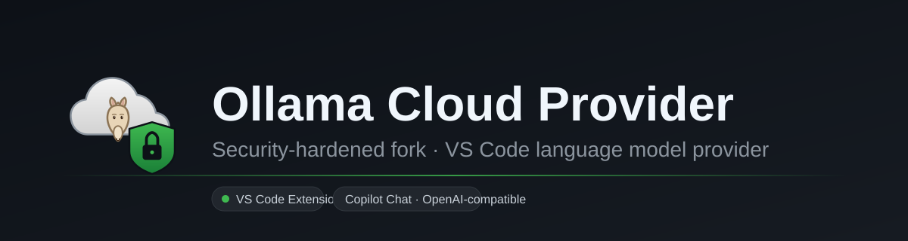

<p align="center">
  
</p>

# Ollama Cloud Provider

**Security-hardened Ollama Cloud language model provider for VS Code Copilot Chat.**

This is a security-hardened fork of [Ollama-Cloud-for-Copilot](https://github.com/zelosleone/Ollama-Cloud-for-Copilot) by Denizhan Dakılır, with supply-chain hardening, secret-handling improvements, and reliability features. It registers Ollama Cloud models as native VS Code language models, making them available in Copilot Chat.

## Why this fork?

The upstream extension is clean and minimal, but has three unresolved security concerns:

1. **Unverifiable supply chain** — single-author Marketplace VSIX, no CI, no signed releases, no SBOM.
2. **Logger without redaction** — no structural guarantee that sensitive data won't be logged.
3. **No baseUrl restrictions** — the API key can be sent to any host the user configures.

This fork closes all three:

- **CI-built, signed releases** — every VSIX is built in GitHub Actions, signed with Sigstore (keyless) + GPG, with SHA256 checksums and SBOM.
- **Logger redaction** — `Bearer` tokens and `api_key` patterns are masked before any `JSON.stringify`.
- **baseUrl whitelist** — the extension refuses to send requests to any host not in `ollamaCloud.allowedBaseUrls`.

## Features

- Native VS Code `LanguageModelChatProvider` — Ollama Cloud models appear in Copilot Chat model picker.
- API key stored in OS-backed `SecretStorage` (not plaintext settings).
- `scope: "application"` on all config — workspace `.vscode/settings.json` cannot override keys or redirect traffic.
- Streaming responses with thinking/reasoning support.
- Tool calling (handled by VS Code, not the extension — no `child_process`).
- Health check and configuration validation commands.
- Retry with exponential backoff for transient failures.
- Configurable request timeout.

## Installation

### From GitHub Release (recommended)

1. Go to [Releases](https://github.com/Korrnals/ollama-cloud-provider/releases).
2. Download the `.vsix` for the latest release.
3. Verify the SHA256 checksum:
   ```bash
   sha256sum -c sha256.txt
   ```
4. Verify the Sigstore signature (optional, requires [cosign](https://github.com/sigstore/cosign)):
   ```bash
   cosign verify-blob --certificate-identity-regexp 'https://github\.com/Korrnals/ollama-cloud-provider/.+' --certificate-oidc-issuer https://token.actions.githubusercontent.com --signature ollama-cloud-provider-*.vsix.sig ollama-cloud-provider-*.vsix
   ```
5. Install:
   ```bash
   code --install-extension ollama-cloud-provider-*.vsix
   ```

### From source

```bash
git clone https://github.com/Korrnals/ollama-cloud-provider.git
cd ollama-cloud-provider
npm ci
npm run package
code --install-extension ollama-cloud-provider-*.vsix
```

## Setup

1. Get an Ollama Cloud API key at [ollama.com](https://ollama.com/).
2. Run `Ollama Cloud: Set API Key` from the VS Code command palette.
3. Open Copilot Chat and select an Ollama Cloud model from the model picker.

## Configuration

| Setting | Default | Description |
|---|---|---|
| `ollamaCloud.apiKey` | `""` | Fallback API key. Prefer the command palette (stores in SecretStorage). |
| `ollamaCloud.baseUrl` | `https://ollama.com/v1` | API base URL. Must be in `allowedBaseUrls`. |
| `ollamaCloud.allowedBaseUrls` | `["https://ollama.com/v1"]` | Whitelist of permitted base URLs. |
| `ollamaCloud.requestTimeoutMs` | `120000` | Request timeout in ms. |
| `ollamaCloud.maxRetries` | `3` | Max retries for transient failures (429, 5xx). |

All settings are `scope: "application"` — workspace folders cannot override them.

## Security

See [SECURITY.md](SECURITY.md) for the security policy and responsible disclosure.

## Acknowledgements

This extension is a fork of [Ollama-Cloud-for-Copilot](https://github.com/zelosleone/Ollama-Cloud-for-Copilot) by Denizhan Dakılır. The original MIT license and attribution are preserved.

## License

MIT — see [LICENSE](LICENSE).
