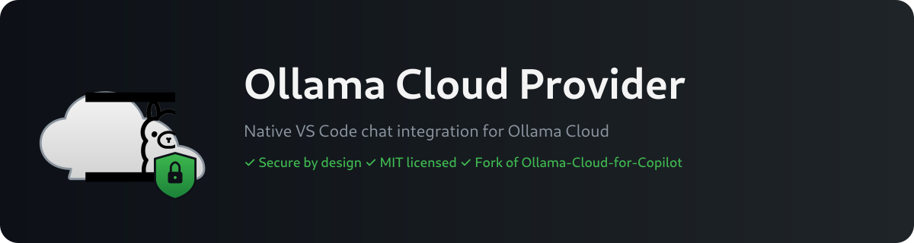

<p align="center">
  
</p>

[](https://marketplace.visualstudio.com/items?itemName=Korrnals.ollama-cloud-provider)
[](https://marketplace.visualstudio.com/items?itemName=Korrnals.ollama-cloud-provider)

# Ollama Cloud Provider

**Use Ollama Cloud models in VS Code Copilot Chat.**

## Overview

Ollama Cloud Provider registers Ollama Cloud models as native VS Code language models, making them available in the Copilot Chat model picker. Configure an API key, select a model, and chat — no wrappers, no extra UI, no separate chat window.

The extension is built for reliability and safety: API keys live in OS-backed secret storage, requests only go to URLs you explicitly allow, and every release is signed and checksummed.

## Key features

- **Native Copilot Chat integration** — Ollama Cloud models appear in the Copilot Chat model picker as first-class VS Code language models.
- **Secret storage** — API keys are stored in the OS-backed secret store, never in `settings.json` or workspace files.
- **`/v1/responses` primary endpoint** — cloud connections use the OpenAI Responses API by default, with structured streaming and reasoning shown as a collapsed thinking block in Copilot Chat (`LanguageModelThinkingPart`, VS Code 1.103+). `/chat/completions` is the automatic fallback on HTTP 404.
- **Proxy-aware networking** — a native HTTP client bypasses VS Code's `global.fetch()` interception, fixing connect-timeout issues under `chat.agent.sandbox.enabled: "on"`. Respects the `http.proxy` VS Code setting.
- **Tool calling** — fully supported via `/v1/responses` with top-level `function_call` / `function_call_output` input items (OpenAI Responses API spec). Handled natively by VS Code, with no shell execution from the extension.
- **Automatic model sync** — model catalog auto-refreshes on startup and when connection settings change. Use `Ollama Cloud: Refresh Models` to force a sync at any time.
- **Multi-connection** — connect to several OpenAI-compatible endpoints (Cloud, Local, VPS, custom) with per-connection API keys and URL whitelists.
- **Retry and timeout** — exponential backoff for transient failures, three-tier streaming timeout (see ADR 0005).
- **Streaming timeout architecture** — three timers protect against dead connections without killing legitimate long-reasoning streams: connect timeout (30s, retried), inactivity timeout (90s, reset on each chunk), max-duration safety cap (30 min, prevents forgotten-tab token leaks).
- **Health check** — probe the endpoint and discover models before chatting.
- **Configuration validation** — catch misconfiguration (missing key, URL not whitelisted) before it breaks a chat.

## Security posture

Security is a first-class concern:

- **Supply chain integrity** — every release is signed and checksummed.
- **Secret safety** — API keys live in OS-backed secret storage, never in settings files or logs.
- **Network boundary** — requests only go to URLs you explicitly allow.

## Installation

### From the VS Code Marketplace (recommended)

Open the [Ollama Cloud Provider page](https://marketplace.visualstudio.com/items?itemName=Korrnals.ollama-cloud-provider) and click **Install**. VS Code opens and installs the extension automatically.

Or install from the command line:

```bash
code --install-extension Korrnals.ollama-cloud-provider
```

### From a GitHub Release (signed VSIX)

Download the `.vsix` and checksum file from [Releases](https://github.com/Korrnals/ollama-cloud-provider/releases), verify the SHA256 checksum, and install:

```bash
sha256sum -c sha256.txt
code --install-extension ollama-cloud-provider-*.vsix
```

Releases are signed; see the release notes for signature verification details.

### From source

For developers who want to build locally:

```bash
git clone https://github.com/Korrnals/ollama-cloud-provider.git
cd ollama-cloud-provider
npm ci
npm run compile
npm run package
code --install-extension ollama-cloud-provider-*.vsix
```

## Setup

### 1. Get an API key

Get an Ollama Cloud API key at [ollama.com](https://ollama.com/).

### 2. Configure the extension

Three ways to configure — pick one.

#### Command Palette (recommended)

1. Open the Command Palette: `Ctrl+Shift+P` (Windows/Linux) or `Cmd+Shift+P` (macOS).
2. Run `Ollama Cloud: Set API Key`.
3. Enter the key. It is stored in OS-backed secret storage — never written to `settings.json`.
4. Run `Ollama Cloud: Check Connection` to verify the endpoint and discover models.
5. Open Copilot Chat and select an Ollama Cloud model from the picker.

#### Settings UI

1. Open Settings: `Ctrl+,` or `Cmd+,`.
2. Search for `ollamaCloud`.
3. Set `Ollama Cloud: Base Url` — must be in the allowed URLs list.
4. Add the endpoint to `Ollama Cloud: Allowed Base Urls` if not already listed.
5. Prefer `Ollama Cloud: Set API Key` over the `Ollama Cloud: Api Key` setting — the command stores the key in secret storage instead of plaintext.

#### settings.json

```json
{
  "ollamaCloud.baseUrl": "https://ollama.com/v1",
  "ollamaCloud.allowedBaseUrls": ["https://ollama.com/v1"],
  "ollamaCloud.requestConnectTimeoutMs": 30000,
  "ollamaCloud.requestInactivityTimeoutMs": 90000,
  "ollamaCloud.requestMaxDurationMs": 1800000,
  "ollamaCloud.maxRetries": 3,
  "ollamaCloud.connections": [
    {
      "id": "cloud",
      "label": "Cloud",
      "type": "cloud",
      "enabled": true,
      "baseUrl": "https://ollama.com",
      "openaiCompatiblePath": "/v1",
      "requiresApiKey": true
    }
  ]
}
```

For the API key, use `Ollama Cloud: Set API Key` — it stores the key in secret storage, not in `settings.json`. All settings are `scope: "application"`, so workspace folders cannot override them.

### 3. Verify

Run `Ollama Cloud: Check Connection` to confirm the extension can reach the endpoint and discover models. Then open Copilot Chat and select a model from the picker.

## Configuration

| Setting | Default | Description |
|---|---|---|
| `ollamaCloud.apiKey` | `""` | Fallback API key. Prefer `Ollama Cloud: Set API Key` (stores in secret storage). |
| `ollamaCloud.baseUrl` | `https://ollama.com/v1` | API base URL. Must be in `allowedBaseUrls`. |
| `ollamaCloud.allowedBaseUrls` | `["https://ollama.com/v1"]` | Whitelist of permitted base URLs. |
| `ollamaCloud.requestConnectTimeoutMs` | `30000` | Max time for initial connection. Retried via `maxRetries` on timeout. |
| `ollamaCloud.requestInactivityTimeoutMs` | `90000` | Max gap between stream chunks. Reset on every chunk. No retry (mid-stream retry = double billing). |
| `ollamaCloud.requestMaxDurationMs` | `1800000` | Max total streaming duration (safety cap). Never reset. No retry. |
| `ollamaCloud.requestTimeoutMs` | `120000` | **Deprecated** — use `requestMaxDurationMs`. Alias for backward compat. |
| `ollamaCloud.maxRetries` | `3` | Maximum retries for transient failures (429, 5xx, connect timeout). |
| `ollamaCloud.connections` | `[]` | Multi-connection list. Each entry is a distinct OpenAI-compatible endpoint with its own URL whitelist and API key. When empty, the single-connection settings are used. |
| `ollamaCloud.visionModels` | `[]` | Global vision wildcard patterns. A model id matching any pattern is treated as image-capable. Per-connection `visionModels` override this list. |
| `ollamaCloud.visionFallback.enabled` | `false` | Enable Vision Fallback. Opt-in. |
| `ollamaCloud.visionFallback.model` | `""` | Vision-capable model id for fallback. If empty, auto-searches the primary connection's catalog for the first vision-capable model. |
| `ollamaCloud.visionFallback.connection` | `""` | Connection id for the vision model. If empty, uses the primary connection. |
| `ollamaCloud.preferredEndpoint` | `"responses"` | Primary API endpoint for cloud/remote connections. `"responses"` uses `/v1/responses` (structured reasoning, typed events, first-class tool calling); `"chat"` uses `/chat/completions` (classic OpenAI-compatible). The other endpoint is the automatic fallback on HTTP 404. Local Ollama always uses `/chat/completions` regardless. Per-connection `preferredEndpoint` in `ollamaCloud.connections` overrides this. |

All settings are `scope: "application"` — workspace folders cannot override them.

## Commands

| Command | Description |
|---|---|
| `Ollama Cloud: Set API Key` | Store the API key in OS-backed secret storage. |
| `Ollama Cloud: Clear API Key` | Remove the stored key. |
| `Ollama Cloud: Check Connection` | Probe the configured endpoint. |
| `Ollama Cloud: Validate Configuration` | Validate settings (URL in whitelist, key present). |
| `Ollama Cloud: Set Vision Fallback Model` | Pick a vision-capable model from the catalog. |
| `Ollama Cloud: Set Vision Fallback Connection` | Pick a connection for the vision model (includes a "Clear — use primary connection" option). |
| `Ollama Cloud: Refresh Models` | Force-sync the model catalog with the cloud endpoint, bypassing the 30s cooldown. Shows model count on completion. |
| `Ollama Cloud: Show Registered Models` | List models registered with VS Code. |
| `Ollama Cloud: Show Logs` | Open the extension output channel. |

## Model Sync

The extension automatically syncs the model catalog from the cloud endpoint:

- **On startup** — the catalog refreshes immediately after activation, so new models (e.g. newly added cloud models) appear without a restart or config change.
- **On config change** — changing `ollamaCloud.baseUrl`, `ollamaCloud.connections`, or `ollamaCloud.allowedBaseUrls` triggers a sync (with a 30s cooldown to avoid spamming).
- **Manual refresh** — run `Ollama Cloud: Refresh Models` to force a sync at any time, bypassing the cooldown. The command shows a progress notification and displays the model count on completion.

## `/v1/responses` Endpoint

Since v0.6.0, cloud connections use the OpenAI `/v1/responses` API as the primary endpoint, with `/chat/completions` as a fallback. Benefits:

- **Structured reasoning** — reasoning/thinking tokens are surfaced as collapsed thinking blocks in Copilot Chat (`LanguageModelThinkingPart`, VS Code 1.103+).
- **Typed streaming events** — `response.created`, `response.reasoning_summary_text.delta`, `response.output_text.delta`, `response.completed`.
- **First-class tool calling** — tool calls and results are top-level `function_call` / `function_call_output` input items, matching the OpenAI Responses API spec.

Local Ollama connections always use `/chat/completions` (local Ollama does not implement `/v1/responses`). Cloud connections with `preferredEndpoint: 'chat'` also use `/chat/completions` directly. The capability cache memoizes 404 responses per connection, so the fallback to `/chat/completions` happens instantly after the first 404.

## Vision Fallback

When the selected model cannot handle images, the extension can automatically use a vision-capable model you configure. The vision model answers for that turn only; the next turn returns to the primary model. Opt-in, with a routing disclosure notification.

To enable:

1. Set `ollamaCloud.visionFallback.enabled` to `true`.
2. Run `Ollama Cloud: Set Vision Fallback Model` to pick a vision-capable model from the catalog.
3. Optionally run `Ollama Cloud: Set Vision Fallback Connection` if the vision model lives on a different connection.
4. Send an image to a non-vision model — the extension swaps to the vision model for that turn and notifies.

## License

MIT — see [LICENSE](LICENSE).
