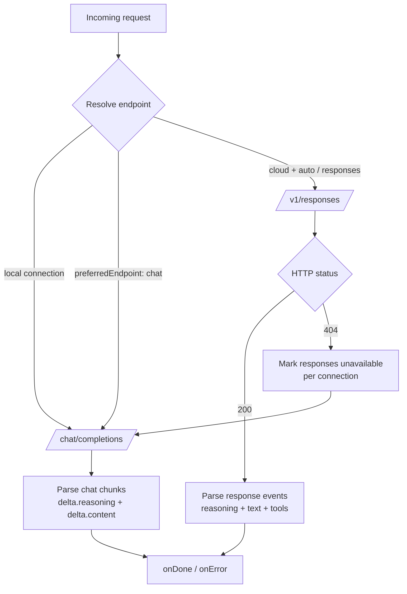

# 0006. /v1/responses as Primary Endpoint with /chat/completions Fallback

**Date:** 2026-07-27
**Status:** Accepted

## Deciders

- `@GCW: Tech Lead` (chair, engineering owner)
- `@GCW: Product Architect`
- `@GCW: Senior System Engineer`
- `@GCW: Senior QA Engineer`
- Owner (Korrnals) — final decision authority

## Context

The extension is a security-hardened `LanguageModelChatProvider` for Ollama Cloud (ADR 0001). Until v0.5.x it used only `/chat/completions`, where `delta.reasoning` is mixed with `delta.content` and reasoning is not visually separated. The owner wants `/v1/responses` — the modern OpenAI-compatible endpoint — as the PRIMARY endpoint for cloud connections, with structured reasoning surfaced as a distinct thinking block in the VS Code chat UI.

A spike (2026-07-27) confirmed `/v1/responses` works on Ollama Cloud:

- Streaming with typed events (`response.created`, `response.in_progress`, `response.output_item.added`, `response.reasoning_summary_text.delta`, `response.output_text.delta`, `response.completed`).
- Structured output via `output[]` array with typed items (`reasoning`, `message`, `function_call`).
- Tool calling via `function_call` output type with `call_id`, `name`, `arguments`.
- Vision via `input:[{type:"message",content:[{type:"input_text"},{type:"input_image"}]}]`.
- `instructions` field for system prompt (separate from user input).
- `text.format` (json_schema), `truncation`, `max_output_tokens`, `max_tool_calls`.

Two constraints shape the decision:

1. **Resumption is broken on the current tier.** `previous_response_id` returns `null`; `store: true` is ignored by the server. Stateful features cannot be used.
2. **Local Ollama may not support `/v1/responses`.** The endpoint is OpenAI 2024+; local Ollama's compatibility layer covers `/chat/completions` only. Local connections must route to `/chat/completions` directly.

The extension stays a thin provider per ADR 0001: provider-not-agent, no autonomous retries mid-stream, no stateful session management, security-hardened, zero new runtime dependencies, 9 CI gates.

The committee convened to decide the architecture that adopts `/v1/responses` as primary without breaking the existing `/chat/completions` path or the 322-test regression suite.

## Decision

Migrate to `/v1/responses` as the PRIMARY endpoint for cloud connections, with `/chat/completions` as fallback. Hybrid architecture with a separate `responsesClient.ts` (not a god-class with two modes). Structured reasoning surfaced via `vscode.LanguageModelThinkingPart`. No stateful features used.

### Endpoint selection (in `provider.ts`)

| Condition | Endpoint |
|---|---|
| `ConnectionType === 'local'` | `/chat/completions` (local Ollama does not support `/v1/responses`) |
| `preferredEndpoint === 'chat'` (user override) | `/chat/completions` |
| `preferredEndpoint === 'auto'` (default) + cloud | `/v1/responses`, fallback to `/chat/completions` on HTTP 404 |
| `preferredEndpoint === 'responses'` + cloud | `/v1/responses`, `onError` on 404 (explicit override, no silent fallback) |

### Capability cache

- Per-connection, session-lifetime, in-memory.
- On HTTP 404 from `/v1/responses` → memoize "responses unavailable" for that connection.
- Subsequent requests to that connection route directly to `/chat/completions` without re-probing.
- Reset on VS Code restart.

### No mid-stream fallback

POST is non-idempotent. A mid-stream retry bills the user twice and shows a duplicate prefix already displayed. On 404 at request start (before the first chunk) → fallback to `/chat/completions`. On mid-stream error → `onError`, no fallback. Consistent with ADR 0001 (provider-not-agent) and ADR 0005 (no mid-stream retry).

### Structured reasoning

`response.reasoning_summary_text.delta` event → `onThinking` callback → `vscode.LanguageModelThinkingPart`. VS Code renders this as a collapsed "thinking" block. Graceful fallback to `LanguageModelTextPart` with a prefix if `LanguageModelThinkingPart` is unavailable (VS Code < 1.103).

### Stateful features NOT used

| Feature | Why not |
|---|---|
| `previous_response_id` | Spike confirmed: returns `null`, resumption broken on current tier |
| `store: true` | Ignored by the server (spike confirmed) |
| `background: true` | Changes UX to async polling — future ADR, out of scope here |
| `metadata` | Stateful, violates thin-provider identity per ADR 0001 |
| `prompt_cache_key` | Stateful, violates thin-provider identity per ADR 0001 |

### Security invariants (must hold on implementation — verify before merge)

- **SEC-03** per-connection `allowedBaseUrls` whitelist — enforced on BOTH endpoints.
- `redactSensitive` — all log paths, both clients.
- `scope: application` on the new `preferredEndpoint` setting.
- No `child_process` / `eval` / `webview` / `telemetry` — the 9 CI gates enforce this.
- Zero new runtime dependencies.

### Architecture

### Implementation phases

| Phase | What | Complexity | Gate |
|---|---|---|---|
| 0 | ADR 0006 + `protocolTypes.ts` types + `capabilityCache.ts` | S | Types compile, no behaviour change |
| 1 | `convertResponses.ts` + `responsesClient.ts` + unit tests | M | New tests green, 322 existing untouched |
| 2 | `provider.ts` dispatch + `connections.ts` `preferredEndpoint` + integration tests | M | Cloud routes to `/v1/responses`, falls back on 404 |
| 3 | `visionFallback.ts` endpoint resolution + structured reasoning `LanguageModelThinkingPart` | S | Reasoning visible in chat UI, e2e test |

Complexity: S = small, M = medium.

### File impact

| File | Type | Lines |
|---|---|---|
| `src/responsesClient.ts` | NEW | ~350 |
| `src/convertResponses.ts` | NEW | ~140 |
| `src/convertPrimitives.ts` (extract from `convert.ts`) | NEW | ~80 |
| `src/capabilityCache.ts` | NEW | ~60 |
| `src/protocolTypes.ts` | MOD | +60 |
| `src/connections.ts` | MOD | +30 |
| `src/provider.ts` | MOD | +50 |
| `src/visionFallback.ts` | MOD | +10 |
| Tests | NEW | ~650 |
| **Total** | | **~720 code + ~650 tests** |

## Consequences

### Positive

- **Structured reasoning** — `response.reasoning_summary_text.delta` surfaces as `vscode.LanguageModelThinkingPart`; VS Code renders a collapsed thinking block. Reasoning is visually separated from the answer.
- **Typed events** — `response.created` / `response.in_progress` / `response.output_item.added` / `response.output_text.delta` / `response.completed` replace the flat `delta` blob; the parser is more robust and easier to extend.
- **First-class tool calling** — `function_call` output type with `call_id`, `name`, `arguments` is cleaner than `choices[].delta.tool_calls`.
- **Modern API evolution** — `/v1/responses` is the endpoint OpenAI is investing in; the extension tracks the upstream direction.
- **Fallback preserved** — `/chat/completions` remains for local Ollama, 404, and user override; the 322-test regression suite stays intact.

### Negative

- **Dual codebase** — ~720 lines of new code (`responsesClient.ts`, `convertResponses.ts`, `convertPrimitives.ts`, `capabilityCache.ts`) plus ~650 lines of tests. Two SSE parsers, two converters.
- **Endpoint may change** — `/v1/responses` is new on Ollama Cloud, no public docs; it may be removed or changed. Mitigated by the 404 fallback and capability cache.
- **`LanguageModelThinkingPart` requires VS Code 1.103+** — graceful fallback to `LanguageModelTextPart` with a prefix for older versions.

### Neutral

- **Four phases, 2–3 PRs** — phased delivery; each phase has a gate. The 322 existing tests are the regression suite for the fallback path and are not rewritten.

## Alternatives considered

| Alternative | Verdict | Reason rejected |
|---|---|---|
| (A) Merge into one client with two modes | rejected | God-class anti-pattern (`clean-architecture-rules`). Two different SSE protocols (flat `data:` vs `event:`+`data:`) and two converters bloat the class and break single-responsibility. |
| (B) Auto-detect probe on activation | rejected | Extra round-trip on every activation. Lazy 404 + capability cache is better — the probe happens exactly once per connection, on the first request, and is memoized. |
| (C) Mid-stream fallback | rejected | POST is non-idempotent — retry bills twice and shows a duplicate prefix already displayed. ADR 0001/0005 violation; unanimous rejection. |
| (D) Stateful features (resumption, background, store, prompt_cache_key) | rejected | Resumption broken on current tier (spike confirmed). The rest are stateful and violate the thin-provider identity per ADR 0001. `background: true` changes UX to async polling — future ADR. |
| (E) Rewrite all 322 existing tests | rejected | The 322 tests ARE the regression suite for the `/chat/completions` fallback path. Splitting at the client seam leaves `convert.ts`, `retry.ts`, `visionFallback.ts` shared and untouched. |

## Spike results

**`/v1/responses` on Ollama Cloud (2026-07-27):**

- **Streaming:** typed events — `response.created`, `response.in_progress`, `response.output_item.added`, `response.reasoning_summary_text.delta`, `response.output_text.delta`, `response.completed`.
- **Structured output:** `output[]` array with typed items — `reasoning`, `message`, `function_call`.
- **Tool calling:** `function_call` output type with `call_id`, `name`, `arguments`.
- **Vision:** `input:[{type:"message",content:[{type:"input_text"},{type:"input_image"}]}]`.
- **System prompt:** `instructions` field (separate from user input).
- **Parameters:** `text.format` (json_schema), `truncation`, `max_output_tokens`, `max_tool_calls`.
- **Resumption:** NOT working — `previous_response_id` returns `null`, `store: true` ignored by the server.

**`/chat/completions` (current):** `delta.reasoning` mixed with `delta.content`, `choices[].delta.tool_calls`, `image_url` for vision.

**Local Ollama** (ConnectionType 'local', `localhost:11434`): may NOT support `/v1/responses` — the endpoint is OpenAI 2024+, and local Ollama's compatibility layer covers `/chat/completions` only.

## References

- ADR 0001 — Security Goals (provider-not-agent invariant, SEC-03 `allowedBaseUrls` whitelist, thin-provider identity)
- ADR 0003 — Native Provider UX
- ADR 0005 — Streaming Timeout Architecture (connect / inactivity / max-duration timers — inherited by `responsesClient.ts`; no mid-stream retry constraint)
- `src/connections.ts` — `ConnectionType: 'cloud' | 'local' | 'remote' | 'custom'`; `DEFAULT_LOCAL_BASE_URL = 'http://localhost:11434'`
- `clean-architecture-rules` skill — routing concern vs transport; god-class anti-pattern
- Mnemos: `53cbc4e6-75b4-4279-8ff7-64e73fbbcf7d`