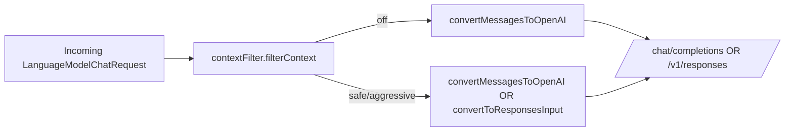

# 0007. Context Filtering (Pre-Model Payload Processing)

**Date:** 2026-07-29
**Status:** Accepted

## Deciders

- `@GCW: Tech Lead` (chair, engineering owner)
- `@GCW: Product Architect`
- `@GCW: Senior System Engineer`
- `@GCW: Senior QA Engineer`
- Owner (Korrnals) — final decision authority

## Context

The extension is a security-hardened `LanguageModelChatProvider` for Ollama Cloud (ADR 0001). Long chat sessions and tool-heavy workflows push request payloads well past what the model needs:

- **Duplicate messages** — the chat UI re-sends the trailing context on every turn; some clients emit the same assistant summary twice when reasoning is duplicated across endpoints.
- **Redundant tool definitions** — providers commonly advertise the same `function.name` with identical schemas across multiple tool entries; every duplicate is paid for again.
- **Large system prompts** — multi-line system prompts accumulate trailing whitespace, blank separator lines, and indented blocks that carry no semantic weight but bill at the model's token rate.
- **Empty content parts** — converters occasionally emit zero-length text parts; the model still spends a structural token on each.

Token cost is the user's money. The owner's original ask (Issue #39) referenced similar pre-model compaction features in Hermes and OmniRouter, and asked for a comparable capability that does **not** introduce a second model call and does **not** activate without the user's consent.

Four constraints shape the decision:

1. **Zero runtime dependencies (ADR 0001).** No tokenizer (`tiktoken`, etc.) — exact token counts would require a native dependency or WASM blob, violating the invariant. The filter uses a char-based proxy.
2. **Predictability.** The filter must never activate unless the user sets a non-`off` level. No heuristic auto-enable on "high token count" — the user opts in, the user sees what was dropped.
3. **Provider-not-agent (ADR 0001).** The filter is a pure transform on the payload, not a decision-maker. It does not call a model, does not summarise, does not choose what the user "really meant". It removes structural redundancy and (at `aggressive`) enforces a context-window budget.
4. **Endpoint-agnostic.** The filter runs at the provider entry point, before the convert step (`convertMessagesToOpenAI` / `convertToResponsesInput`). Both `/v1/responses` and `/chat/completions` benefit — the filter does not know which endpoint will serve the request.

The committee convened to decide a context-filtering scheme that delivers meaningful token savings without violating any of the four constraints and without corrupting tool-call integrity.

## Decision

Add a pre-model processing layer — `src/contextFilter.ts` — that filters and compacts the request payload before the convert step. Three user-selected levels (`off` / `safe` / `aggressive`), configured globally with a per-connection override. The module is pure functions, no network, no I/O, no side effects. A binding tool-call-integrity rule guarantees that a dropped `tool_call` always drops its matching `tool_call_output` and vice versa. Vision content is never filtered.

### Levels

| Level | Behaviour |
|---|---|
| `off` (DEFAULT) | No filtering. Payload sent as-is. No logging. |
| `safe` | Structural cleanup only. No message removal. No truncation. |
| `aggressive` | `safe` + context-window management + message merging + metadata stripping. |

#### `safe` — precise semantics

- **Duplicate messages** — drop a message when an earlier message in the list has the **same `role` AND identical `content`** (byte-for-byte string equality for string content; deep-equal for part arrays, with `input_image` parts compared by reference identity, not by base64 bytes). Order preserved for the surviving copy.
- **Empty content parts** — remove parts where `type === 'text'` and `text` is zero-length or whitespace-only. If all parts of a message are removed and the message has no `tool_calls` / `tool_call_id`, drop the message.
- **Whitespace trim** — trim leading/trailing whitespace on each text part's value. Internal whitespace runs are NOT collapsed at `safe` (that is the system-prompt compaction step below).
- **Dedup tools** — drop a tool entry when an earlier entry has the same `function.name`. The first definition wins; later duplicates are removed. Schemas are not deep-compared (same name ⇒ same tool by contract).
- **Compact system prompts** — for the system message only (role `system`), collapse runs of whitespace (spaces, tabs, newlines) into a single space and trim. No token removal, no word removal, no semantic change. Applied to string content and to `text` parts of part-array content. Non-system messages are NOT compacted at `safe` (a user's deliberate formatting in a code block must survive `safe`).

#### `aggressive` — precise semantics

Everything in `safe`, plus:

- **Truncate oldest messages** — when the char-based payload estimate (via `countOpenAIRequestChars`) exceeds `maxInputTokens * 0.9 * CHARS_PER_TOKEN`, drop messages from the **front** of the list (after the system prompt) until the estimate is under budget. **Preserve the system prompt and the last user message unconditionally.** `CHARS_PER_TOKEN = 4` (English proxy — see Risks for the CJK caveat). The 0.9 factor is a safety margin so a char-proxy under-estimate does not push the real token count over the model's limit. Tool-call integrity (see below) is enforced after every drop.
- **Merge similar adjacent messages** — when two **adjacent** messages have the **same `role`** and a **Jaccard similarity ≥ 0.8** over whitespace-normalised word multisets, merge them into one message: content concatenated with a single `\n` separator. "Whitespace-normalised word multiset" = lowercased, split on `\s+`, empty tokens discarded, counted as a multiset (Bag-of-words with counts). Jaccard over multisets: `|A ∩ B| / |A ∪ B|` where intersection takes the min count and union takes the max count per word. Threshold 0.8 chosen: below 0.8 the messages usually differ in a way the user would notice losing (e.g. two user turns that look similar but ask different follow-ups); above 0.8 the messages are near-duplicates where a merge preserves the signal. Tool-call-bearing messages are NEVER merged (tool-call integrity).
- **Strip non-essential metadata** — remove fields the model ignores and that are not required by the OpenAI/Ollama message schema. Specifically: `name` (optional sender label on assistant/user messages), `refusal` when empty string, and unknown top-level keys not in the recognised set `{role, content, tool_calls, tool_call_id, name, refusal}`. Never strip `role`, `content`, `tool_calls`, `tool_call_id` — these are structurally required.

### Configuration

| Setting | Scope | Type | Default |
|---|---|---|---|
| `ollamaCloud.contextFilter.level` | application | enum `off` \| `safe` \| `aggressive` | `off` |
| `connection.contextFilter.level` | per-connection | enum `off` \| `safe` \| `aggressive` \| `auto` | `auto` |

The per-connection value **overrides** the global when set to `off` / `safe` / `aggressive`. The value `auto` (and `undefined`) **inherits** the global — mirroring the `preferredEndpoint` override/inherit pattern from ADR 0006. This keeps the global as the single switch and the per-connection dial as the escape hatch for one noisy connection or one strict one.

### Tool-call integrity (binding rule)

When the filter drops or merges a message carrying a `tool_call` (assistant message with `tool_calls: [{id, ...}]`), it MUST also drop every `tool`-role message whose `tool_call_id` matches one of the dropped call ids. Symmetrically, when the filter drops a `tool`-role message (the `tool_call_output`), it MUST also remove the matching `tool_call` entry from the assistant message that issued it — or drop that assistant message entirely if it has no remaining `tool_calls` and no `content`.

**Never** leave an orphaned `tool_call_output` referencing a dropped call, and **never** leave a `tool_call` whose output was dropped. A mismatched pair corrupts the conversation for the model: the model sees a result with no preceding call, or a call with no result, and produces incoherent output or refuses to answer.

Concrete example:

```
messages: [
  { role: 'user',      content: 'list files' },
  { role: 'assistant', tool_calls: [{ id: 'call_1', type: 'function', function: { name: 'ls', arguments: '{}' } }] },
  { role: 'tool',      tool_call_id: 'call_1', content: 'file_a\nfile_b' },
  { role: 'assistant', content: 'The files are: file_a, file_b' },
]
```

If `aggressive` truncation drops the assistant message with `tool_calls: [{id:'call_1'}]`, the filter MUST also drop the `{role:'tool', tool_call_id:'call_1'}` message. The truncated list becomes:

```
messages: [
  { role: 'user',      content: 'list files' },
  { role: 'assistant', content: 'The files are: file_a, file_b' },
]
```

The integrity check runs **after every drop and after every merge** at `aggressive`, and **after every drop** at `safe` (safe drops are rare — only empty messages — but the rule still applies).

### Module contract

`src/contextFilter.ts` exports a single primary function (signature sketch — implementation owned by Senior System Engineer):

```ts
filterContext(input: {
  messages: readonly OpenAICompatibleMessage[];
  tools:    readonly OpenAICompatibleTool[] | undefined;
  level:    'off' | 'safe' | 'aggressive';
  maxInputTokens: number;
}): {
  messages: OpenAICompatibleMessage[];
  tools:    OpenAICompatibleTool[] | undefined;
  report:   ContextFilterReport;
};
```

Where `ContextFilterReport` carries the counts and items needed for the log line (dropped messages, dropped tools, merged pairs, truncated count, coerced parts, before/after char counts).

Properties:

- **Pure.** No network, no I/O, no `Date.now()`, no module-level mutable state. Given the same input, always returns the same output.
- **No side effects on the input.** Returns new arrays; the caller's `messages` / `tools` are not mutated.
- **Endpoint-agnostic.** Operates on `OpenAICompatibleMessage` (the shape both converters consume). The provider calls it BEFORE `convertMessagesToOpenAI` (for `/chat/completions`) and BEFORE `convertToResponsesInput` (for `/v1/responses`).
- **`off` is a fast path.** When `level === 'off'`, returns the input unchanged with an empty report — no allocation, no scan.
- **Vision content is never filtered.** `input_image` parts are passed through untouched at every level. Silently dropping an image the user attached is worse than the token cost (security: the user must see what they sent).

### Provider integration point



The filter runs once per request, before the convert step. The convert step receives the filtered `messages` + `tools` and is unaware filtering happened. This keeps `convert.ts` / `convertResponses.ts` unchanged and the filter testable in isolation.

### Logging

One log line per filtered request, at `safe` and `aggressive` only (no logging at `off`):

```
Context filter: level=<off|safe|aggressive> before=<N>chars after=<M>chars saved=<P>% (Q messages, R tools)
```

- `before` / `after` measured via `countOpenAIRequestChars` on the input and output message arrays (tools not included in the char count — they are counted separately in the parenthetical).
- `saved` = `round((before - after) / before * 100)`, omitted when `before === 0`.
- `Q` = number of messages dropped + merged + truncated.
- `R` = number of tools deduped.

Dropped/coerced items are logged in the convert-path diagnostic style established in Issue #41 (`convert.ts` / `convertResponses.ts` drop/coerce diagnostics): one line per class of action — `Context filter: dropped <N> duplicate messages`, `Context filter: merged <N> similar pairs`, `Context filter: truncated <N> oldest messages`, `Context filter: dropped <N> orphaned tool outputs`, `Context filter: stripped metadata from <N> messages`. Lines are emitted only when the count for that class is non-zero (no `dropped 0` noise).

### Non-goals

The following are explicitly **out of scope for v0.7.0**:

- **Automatic mode.** The filter never activates unless the user sets a non-`off` level. No heuristic auto-enable on token-count thresholds, session length, or model context-window pressure. Predictability over convenience.
- **Semantic compaction.** No summarisation, no embedding-based dedup, no LLM-in-the-loop during preprocessing. `aggressive` is structural only. Semantic compaction would require a second model call — a provider-not-agent violation (ADR 0001).
- **Per-message token counting.** Use `countOpenAIRequestChars` (char-based) as the proxy. Exact token counting requires a tokenizer dependency, violating zero-runtime-deps.
- **Streaming-aware filtering.** The filter runs once per request, before the stream starts. Mid-stream filtering (compacting the trailing context between chunks) is out of scope.
- **Vision content filtering.** `input_image` parts are never filtered, dropped, or compacted at any level. The user attached the image; the model sees the image.
- **Cross-request state.** The filter is stateless across requests. It does not remember what it dropped last turn. Each request is filtered independently.

## Consequences

### Positive

- **Token savings** — estimate: `safe` 5–15%, `aggressive` 20–40%. These are estimates, not guarantees; actual savings depend on payload redundancy. Measured per-request via the log line so the user can verify.
- **Predictable** — user opts in via the setting; no silent behaviour change. `off` is the default; the existing 322-test regression suite is untouched at `off`.
- **No runtime deps** — the filter is pure TypeScript, no tokenizer, no native module. Zero-runtime-deps invariant (ADR 0001) preserved.
- **Endpoint-agnostic** — both `/v1/responses` and `/chat/completions` benefit; the filter runs at the shared provider entry point.
- **Observable** — the per-request log line + dropped/coerced diagnostics let the operator see exactly what was removed, matching the Issue #41 convert-path diagnostic style.

### Negative

- **`aggressive` truncation can drop context the user wanted.** The user set `aggressive`; the filter obeys. Mitigated by `off` default, per-request log, and the system-prompt + last-user-message preservation rule.
- **`aggressive` message merging can lose message boundaries.** Two adjacent similar messages become one. Tool-call-bearing messages are never merged (integrity rule), which covers the worst case. The Jaccard ≥ 0.8 threshold is conservative — below it, messages are kept separate.
- **Char-proxy under-estimates tokens for non-English text.** CJK: ~1 char ≈ 1 token vs English ~4 chars/token. The 0.9 safety margin on `aggressive` truncation partially compensates, but a CJK-heavy payload can still exceed the model's real token limit after filtering. Documented, accepted (tokenizer would violate zero-deps).

### Neutral

- **Per-request CPU cost.** The filter scans the message list once (and the tool list once at `safe`/`aggressive`). Cost is O(n) in message count — negligible vs network latency and the model's own processing.

## Risks

| Risk | Mitigation |
|---|---|
| Over-filtering at `aggressive` — user loses context they wanted | `off` default; per-request log shows what was dropped; system prompt + last user message preserved unconditionally |
| Tool-call integrity violation — orphaned `tool_call_output` or `tool_call` with no output | Binding rule enforced after every drop and every merge; dedicated tests in the SSE implementation PR (pair every `call_id` drop with its match) |
| Char-proxy inaccuracy for CJK/emoji — `aggressive` truncation under-estimates real tokens | 0.9 safety margin; documented in Consequences; accepted (tokenizer rejected by zero-deps invariant) |
| Filter + convert interaction — filter output fed to two converters (`convertMessagesToOpenAI`, `convertToResponsesInput`) | Module contract: filter runs BEFORE convert, output is still valid `OpenAICompatibleMessage` shape; converters are unchanged and unaware |
| `safe` system-prompt compaction alters user-visible formatting | Applied to `system` role only; non-system messages keep formatting at `safe`; `aggressive` does not compact non-system message internals beyond the `safe` system rule |

## Alternatives considered

| Alternative | Verdict | Reason rejected |
|---|---|---|
| (A) Automatic mode — filter activates when token count exceeds a threshold | rejected | Violates predictability. The user must opt in. Silent behaviour change on a security-hardened provider is unacceptable. |
| (B) Semantic compaction — summarise old messages with a second model call | rejected for v0.7.0 | Provider-not-agent violation (ADR 0001): the filter would become a decision-maker calling a model. Adds a second billed round-trip. Future ADR if the owner wants it. |
| (C) Tokenizer dependency (`tiktoken` et al.) | rejected | Zero-runtime-deps invariant (ADR 0001). Native/WASM tokenizer adds supply-chain and attack surface disproportionate to the precision gain. |
| (D) Per-message token counting via a model API | rejected | No such API in the OpenAI-compatible surface; would need an extra round-trip per request. Char-proxy is sufficient for a budget enforcement, not a billing estimate. |
| (E) Filter inside the converters (`convert.ts` / `convertResponses.ts`) | rejected | Couples filtering to protocol translation; the filter becomes endpoint-specific; harder to test in isolation. Separate module + run-before-convert keeps the converters unchanged. |
| (F) Two-level scheme (`off` / `on`) | rejected | Too coarse. `safe` (no message removal) and `aggressive` (with truncation) serve different risk appetites; collapsing them forces users who want dedup but not truncation into the truncation path. |

## Revision history — 2026-08-15 (native `/api/chat` integration)

**Native `/api/chat` now consumes the filtered payload.** ADR 0009 later made
native the cloud default (`auto` → native), but the native dispatch block
converted the raw VS Code messages (`convertMessagesToNative`) and bypassed the
filter — the "endpoint-agnostic" property above held in practice only for
`/chat/completions` and `/v1/responses`. The gap is closed by
`convertOpenAIMessagesToNative` / `convertOpenAIToolsToNative`
(`src/convert.ts`): when the filter ran, the filtered OpenAI payload converts
directly to the native schema (no VS Code ↔ OpenAI round-trip, symmetric with
`convertOpenAIMessagesToResponsesInput`); the raw conversion path is preserved
when the filter is `off`. The filter is now genuinely endpoint-agnostic across
all three endpoints, and `requestChars` (computed after the filter) is accurate
on the native path too.

## References

- ADR 0001 — Security Goals (zero-runtime-deps invariant, provider-not-agent, SEC-03 `allowedBaseUrls` whitelist — the filter inherits all security invariants)
- ADR 0006 — `/v1/responses` as Primary Endpoint (the filter is endpoint-agnostic but integrates at the same provider entry point; the per-connection override/inherit pattern mirrors `preferredEndpoint`)
- Issue #39 — Context filtering feature request (owner's original ask, references Hermes and OmniRouter)
- `src/convert.ts` — `countOpenAIRequestChars` (the char-based proxy used for before/after measurement and `aggressive` budget enforcement)
- Issue #41 — convert-path drop/coerce diagnostics (the logging style this ADR's diagnostics mirror)
