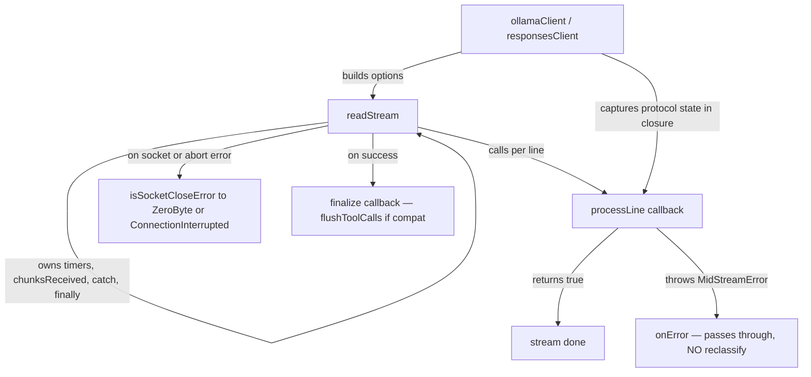

# 0010. Shared Stream Reader — extracting the streaming lifecycle

**Date:** 2026-08-08
**Status:** Accepted (conditional — 8 conditions, all mandatory; see §"Conditions")

> **Note — 2026-08-11 (v0.11.0).** The inactivity timer referenced throughout
> this ADR (Decision §"Three-timer architecture"; ADR 0005 §2; ADR 0011) was
> permanently disabled in v0.11.0 (ArchCom 0011b/0011c). `resetInactivity`
> remains in the `StreamLineContext` interface for backward compatibility but
> is a no-op; `InactivityTimeoutError` is retained in `retry.ts` but
> unreachable at runtime. The extraction itself is unchanged — only one of
> the three timers it extracts is now dead code. See ADR 0005 revision
> history and ADR 0011 revision.

## Deciders

- `@GCW: Tech Lead` (chair, engineering owner)
- `@GCW: Product Architect`
- `@GCW: Senior Security Engineer`
- `@GCW: Senior System Engineer`
- Owner (Korrnals) — final decision authority

## Context

The extension is a security-hardened `LanguageModelChatProvider` for Ollama Cloud (ADR 0001). Two HTTP clients carry their own streaming implementations:

- `ollamaClient.ts` — POST `/v1/chat/completions`, SSE `data:` delta format (~1200 lines)
- `responsesClient.ts` — POST `/v1/responses`, responses event format (~790 lines)

ADR 0006 made `responses` the primary endpoint but mandated **client independence** — each client owns its own parser. ADR 0008 (stream error handling) explicitly deferred unifying the two parsers:

> The shared-parser refactor (rejected alternative) remains an open question for a future ADR.

This is that ADR. The committee convened to decide whether and how to extract the shared streaming lifecycle.

### The duplication (verified before the committee)

A grep audit (2026-08-08) confirmed the duplication is far larger than the ~30 lines originally estimated — closer to **~600 lines of lifecycle code (~300 per client)** plus **~120 lines of duplicated helpers and constants**:

| Duplicated concern | Where |
|---|---|
| Three-timer architecture (connect / inactivity soft+grace / max-duration, ADR 0005) | identical `setTimeout`/`clearTimeout` pattern in both clients |
| Reader loop + 1 MiB buffer cap | duplicated read loop in both clients |
| `chunksReceived` tracking + 0-chunks / >0-chunks boundary | identical boundary logic |
| Socket-close error reclassification (ADR 0008 v0.9.2) | identical `isSocketCloseError(error)` → `ZeroByteSocketCloseError` / `ConnectionInterruptedError` blocks |
| AbortError routing by `abortReason` | identical routing in both clients |
| `resolve*TimeoutMs` helpers + shared constants | duplicated across both files |

The duplication is **byte-for-byte identical in the error path**; the only divergence is in the success path — `flushToolCalls` for compat-mode chat completions.

### Pain point (evidence — v0.9.2)

When v0.9.2 fixed the TLS socket-close abort classification (ADR 0008 Phase 2), the fix had to be applied to **both files identically**. Code Reviewer flagged: "the duplication now extends to the error path, which increases the cost of a future shared-parser refactor." The duplication already shipped a bug twice; the next fix would too.

## Decision

Extract the common streaming lifecycle into a shared module **`src/streamReader.ts`**. Both clients call `readStream(options, callbacks)`, injecting endpoint-specific parsing through a **callback** (not a strategy object).

### Module boundary

The shared module owns the invariant lifecycle; the clients own everything endpoint-specific.

| Stays in the client | Moves to `streamReader.ts` |
|---|---|
| URL resolution (`chatUrl`, `responsesUrl`) | Three timers (max-duration, inactivity soft+grace) |
| Body construction (compat / native / responses) | `withRetry` connect wrapper + per-attempt `AbortController` |
| `assertBaseUrlAllowedOrThrow` (SEC-03 whitelist) | Reader loop + 1 MiB buffer cap |
| Line parser (`processLine` / `processResponsesLine`) | `chunksReceived` tracking + 0 / >0 boundary |
| Protocol state (`pendingToolCalls`, `pendingEvent`) | Socket-close reclassification (ADR 0008) |
| `flushToolCalls` (compat only) | AbortError routing by `abortReason` |
| Headers build (apiKey) | `finally` cleanup + `resolve*` helpers + constants |

### Interface (callback injection)

The callback carries its own terminal condition — the shared module **does not hardcode** `[DONE]` or `response.completed`.

```typescript
export interface StreamLineContext {
  resetInactivity: () => void;
}

// Returns true when the stream is done (terminal condition is the callback's
// responsibility — the shared module never hardcodes [DONE] / response.completed).
export type StreamLineProcessor = (
  line: string,
  ctx: StreamLineContext,
) => boolean;

export type StreamFinalizer = (callbacks: StreamCallbacks) => void;

export interface StreamReaderOptions {
  logTag: string;
  url: string;
  headers: Record<string, string>;
  body: string;
  cancellationToken?: CancellationToken;
  processLine: StreamLineProcessor;
  finalize?: StreamFinalizer;
}

export function readStream(
  options: StreamReaderOptions,
  callbacks: StreamCallbacks,
): Promise<void>;
```

### Migration strategy — big-bang, test-first

A single PR (`refactor/sse-parser-shared`) rewrites both clients in one merge. The migration is **big-bang**, not phased, because the `abortReason` tag flows from the timers → through the `withRetry` connect wrapper → through the reader loop → into the catch routing. Phased extraction breaks this flow at every phase boundary, tripling the regression surface; an intermediate state (some helpers shared, some inline) is more confusing than the current symmetric duplication.

The regression risk of big-bang is mitigated by **test-first**: `test/unit/streamReader.test.ts` (the module contract, including "typed errors pass through" and every edge case) is written **before** the extraction (Phase 0). The regression net exists before any old code is removed.

### Data flow



## Conditions (8 — all mandatory)

The decision is **conditional** on all eight conditions below. Each was raised by a committee participant during the challenge phase and is non-negotiable for the merge.

| # | Condition | Raised by | Rationale |
|---|---|---|---|
| 1 | **Callback injection**, not strategy pattern — the only variant is the line-parsing function | Senior System Engineer | Everything else is invariant; a strategy object over-abstracts a single variable |
| 2 | **Callback carries the terminal condition** — the module does not hardcode `[DONE]` / `response.completed` | Senior System Engineer | Chat-completions ends on `data: [DONE]`; responses ends on `response.completed` — a hardcoded marker would couple the module to one protocol |
| 3 | **`chunksReceived` is incremented by the shared module**, not by the callback | Senior Security Engineer | The callback must not influence the retry / terminal boundary — that boundary is the module's invariant |
| 4 | **"Typed errors pass through"** — `MidStreamError` and peers pass through the catch without reclassification — explicit in code + a unit test on the module | Senior Security Engineer | Parsing callbacks throw typed errors carrying domain semantics; reclassifying them would erase that meaning |
| 5 | **`ConnectionInterruptedError` constructor-guard** (`chunksReceived > 0` else `RangeError`) remains as defense-in-depth | Senior Security Engineer | The boundary must be self-documenting even if the module invariant drifts |
| 6 | **Test-first** — `streamReader.test.ts` is written before the extraction (Phase 0) | Senior Security Engineer + Tech Lead | The regression net must exist before any old code is removed |
| 7 | **Header doc** documents the `retry.ts` coupling — the module is **not** a generic SSE reader | Senior Security Engineer + Product Architect | It encodes Ollama Cloud non-idempotency + token-billing semantics via `retry.ts` error classes; a future reader must know this is not reusable as-is |
| 8 | **One PR** `refactor/sse-parser-shared` — both client rewrites (Phase 2 + 3) land in a single merge | Tech Lead (chair) | Splitting the migration breaks the `abortReason` tag flow (see migration strategy) |

## Constraints preserved

This is a **behavior-preserving** refactor. The following invariants must hold on the implementation and be verified before merge:

- **ADR 0005 "No mid-stream retry"** — `chunksReceived > 0` failures remain terminal. The refactor must not open a retry path that the current code does not have.
- **ADR 0008 error taxonomy** — all 6 error classes (`ConnectTimeoutError`, `InactivityTimeoutError`, `MidStreamError`, `ZeroByteSocketCloseError`, `ConnectionInterruptedError`, `MaxDurationError`) survive the extraction unchanged. The socket-close reclassification logic moves verbatim into `streamReader.ts`.
- **Behavior-preserving** — the 494-test suite and the 9 CI gates remain green, unchanged. No test is weakened or skipped to achieve green.
- **ADR 0001 security posture** — SEC-03 `allowedBaseUrls` whitelist stays enforced at the fetch boundary (the client still calls `assertBaseUrlAllowedOrThrow` before delegating to `readStream`); `scope: application` on all settings; zero new runtime dependencies.

## Alternatives considered

| Alternative | Verdict | Reason rejected |
|---|---|---|
| **Status quo (no refactor)** | Rejected | The duplication already ships bugs twice — v0.9.2 proved it. ADR 0008 explicitly named this unacceptable and deferred the fix to this ADR. |
| **Extract only error reclassification** | Rejected | Half-measure. Leaves the three timers (~80 lines each) duplicated; the next timer fix still applies twice. The error path and the timer path are the same lifecycle — splitting them creates an inconsistent half-extraction. |
| **Generic stream reader** (protocol-agnostic) | Rejected | Loses domain-specific error semantics. The module is coupled to `retry.ts` error classes that encode Ollama Cloud non-idempotency and the token-billing model. A generic reader would have to re-derive those semantics, or lose them. Condition 7 makes this coupling explicit in the header doc. |
| **Phased migration** (extract helpers first, then the loop, then the catch) | Rejected | Breaks the `abortReason` tag flow that connects timers → `withRetry` connect wrapper → reader loop → catch routing. Each phase boundary becomes a regression surface; the intermediate state (some helpers shared, some inline) is more confusing than the current symmetric duplication. Big-bang + test-first (Conditions 6 + 8) is safer. |

## Consequences

### Positive

- **Single source of truth** for the streaming lifecycle. Future fixes apply once, not twice. ADR 0005's "no mid-stream retry" invariant becomes auditable in a single pass instead of two parallel implementations.
- **The security-critical reclassification boundary is auditable in one place.** The `isSocketCloseError → ZeroByteSocketCloseError / ConnectionInterruptedError` path — the boundary that protects against double-billing — has one implementation instead of two byte-identical copies that can drift.
- **Consistent failure** — a bug in the shared module affects both endpoints identically. Coordinated failure is preferable to silent inconsistency where one endpoint is fixed and the other is not.

### Negative

- **One layer of indirection.** A reader of `ollamaClient.streamChat` must jump to `streamReader.ts` to follow the lifecycle. Mitigated by the header doc (Condition 7) and the module boundary table above.
- **A bug in the shared module affects both endpoints simultaneously.** A defect that today would be isolated to one client now hits both. Mitigated by the dedicated `streamReader.test.ts` contract (Phase 0) and the existing per-client test suites.

### Neutral

- **~250 lines new module, ~-250 net production lines, +150 test lines.** The refactor is roughly line-neutral on production code and adds a focused test file for the module contract.

## Phases (implementation, single PR)

All phases land in one PR, `refactor/sse-parser-shared`. Owner: `@GCW: Senior System Engineer`.

| Phase | What | Gate |
|---|---|---|
| 0 | Write `test/unit/streamReader.test.ts` — module contract (typed errors pass through, 0 / >0 chunks reclassification, timer fire ordering, buffer guard, cancel race) | Tests describe the contract before extraction |
| 1 | Create `src/streamReader.ts`, extract lifecycle + timers + catch + reclassification + helpers | Module compiles, existing tests green |
| 2 | Rewrite `ollamaClient.streamChat` → calls `readStream` with a `processLine` callback | `ollamaClient.test.ts` green |
| 3 | Rewrite `responsesClient.streamResponses` → calls `readStream` with a `processResponsesLine` callback | `responsesClient.test.ts` green |
| 4 | Remove duplicated code from both clients + helpers / constants | 494 tests green, lint clean, diff shows net removal |
| 5 | Code review (`@GCW: Code Reviewer`) — full refactor review | Review passed |

## References

- **Committee protocol (team-local):** `~/.gcw/architectural-committee/2026-08-08-sse-parser-refactor.md`
- **Architectural contract (team-local):** `~/.gcw/architectural-committee/2026-08-08-sse-parser-refactor-contract.md`
- **ADR 0001** — Security Goals (provider-not-agent invariant, SEC-03 whitelist)
- **ADR 0005** — Streaming Timeout Architecture (three-timer design, "no mid-stream retry" invariant)
- **ADR 0006** — `responses` endpoint primary (client independence mandate)
- **ADR 0008** — Stream Error Handling (error taxonomy, deferred this refactor)
- **ADR 0009** — Endpoint Routing (routing context for the two clients)
- **Mnemos decision:** `f190955d` — `mnemos_search(tags=["committee", "project:ollama-cloud-provider"])`
- **Mnemos proposal:** `9463fa25` — original open-question that this decision resolves
