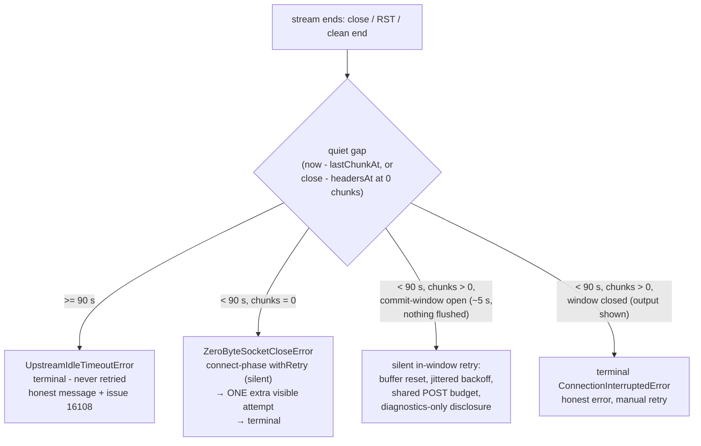
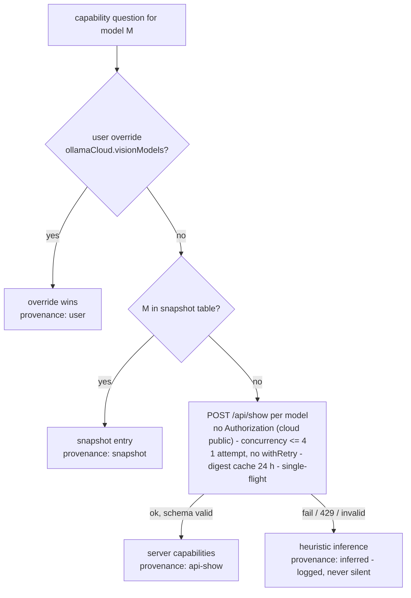

# 0014. Stream Idle-Kill Classification + Live Capability Probing

**Date:** 2026-09-14
**Status:** Accepted — train A shipped in v0.14.0; train B (`/api/show` probing) shipped in v0.15.0; commit-window shipped in 0.15.x (50-chunk threshold abolished)

## Deciders

- `@GCW: Tech Lead` (chair, engineering owner) — split the original single release into trains A/B; froze the 50-chunk threshold until the commit-window
- `@GCW: Senior System Engineer` — idle-kill classification; rejected the 500-chunk threshold and fuzzy de-duplication
- `@GCW: Senior Security Engineer` — POST budget, jitter, Authorization policy, N+1 limits for probing
- `@GCW: Product Architect` — honesty requirement ("retry does not heal long thinking"); probing acceptance criterion

Committee verdict: accept-with-conditions on all three positions (protocol 2026-09-14). Review gate for train B: `@GCW: Senior Security Engineer`.

## Context

Owner report (2026-09-14): «частые отвалы и ошибки, пока модель и агенты работают, думают — вероятно, излишние/некорректные логики таймаутов» and «провайдер не видит, что glm-5.3-flash работает с визуалом».

Research findings (2026-09-14, high confidence):

1. **The killer is upstream, not us.** Ollama Cloud drops streams after ~120–145 s of upstream silence (ollama/ollama#16108, open since 2026-05). Retrying the identical POST reproduces the identical silence — the second drop is guaranteed.
2. **Our timers are innocent.** Since ADR 0012 the only remaining bound is the 60 min max-duration ceiling; nothing on our side kills a quiet stream. The owner's timeout hypothesis was disproven and closed publicly via a changelog entry referencing #16108.
3. **Our retry machinery amplified the damage.** Nested `withRetry` × mid-stream retry allowed up to **12 POSTs per message**; the mid-stream backoff had **no jitter** (thundering-herd risk on a synchronous system-wide outage); every >0-chunk retry re-sent the full request and **duplicated already-shown output**; a 0-chunk idle-kill burned 3 × ~145 s (~7 minutes) of doomed waiting and multiple billings before the guaranteed failure.
4. **Capabilities are absent from catalog endpoints.** Cloud `/v1/models` and `/api/tags` return no capability data. The public per-model `POST /api/show` does return `capabilities` (`vision`/`tools`/`thinking`/`completion`; ollama PR #10066; self-hosted servers expose capabilities in `/api/show` since v0.6.4 and in `/api/tags` since v0.30.0). A hardcoded snapshot therefore rots — glm-5.3-flash was misdetectected as text-only.
5. **Confirmed P0 bug:** the global `ollamaCloud.visionModels` override was never applied to the cloud connection in the runtime vision gate (`provider.ts` resolved `connection = undefined` for cloud).
6. **Security finding:** catalog fetches (`/v1/models`, `/api/tags`) bypassed `ssrfGuard` — the guard was wired only into the stream reader.

## Decision

One committee session, two coupled decisions: (1) classify the upstream idle-kill as a terminal, non-retryable failure; (2) resolve model capabilities from live data instead of a rotting snapshot.

### 1. Idle-kill is a terminal class — never retried (train A, shipped in v0.14.0)

A stream that ends (close / RST / clean end) after a quiet gap ≥ 90 s is classified as the #16108 signature and mapped to a new typed error `UpstreamIdleTimeoutError`:

- The gap is `now - lastChunkAt` (or `close - headersAt` when zero chunks arrived); the stream reader tracks both timestamps and the error carries the measured `quietMs`.
- `IDLE_KILL_QUIET_GAP_MS = 90_000` is a code constant in `streamReader.ts` — deliberately **not** user config; it is tuned from diagnostics, not per user.
- Terminal everywhere: excluded from `withRetry`, excluded from mid-stream retry, detected in the 0-chunk probe path and in every catch branch of the stream reader.
- The user-facing error is honest and actionable (from `provider.ts`): «Ollama Cloud: облако закрыло соединение после N с без данных — модель долго размышляла. Известная проблема Ollama Cloud (ollama/ollama#16108), на стороне расширения таймеры стрим не прерывали. Повторите запрос».

Classification as shipped after the commit-window release (the v0.14.0 interim kept a 50-chunk mid-stream threshold — Decision 5 replaced it with the time-based window):

### 2. POST budget, jitter, visible retry (train A, shipped in v0.14.0)

- **One shared POST budget per message:** connect-phase (`withRetry`), commit-window hidden retries and the zero-byte extra attempt all draw from the same counter, `MAX_POST_BUDGET_PER_MESSAGE = 6` — the worst case drops from 12 POSTs to 6. On exhaustion the stream fails honestly ("POST budget of 6 attempts exhausted — not retrying").
- **Jitter on every retry backoff:** delay = `base * 2^retry * uniform(0.75..1.25)` (±25 %), capped at 10 s for window retries. No unjittered backoff remains on the retry path.
- **Visible vs silent (final semantics after §3.4):** the only auto-retry after which output is re-generated — the in-window hidden retry — is SILENT by design (nothing was shown, so nothing duplicates; disclosed in diagnostics). The remaining visible `onNotice` is the zero-byte extra attempt announcement; with no handler registered the notice is logged, never dropped. Post-shown auto-retry no longer exists.

### 3. Snapshot stopgap, vision-gate P0 fix, ssrfGuard on catalogs (train A, shipped in v0.14.0)

- `glm-5.3-flash` snapshot entry corrected to vision + tools + thinking (verified live via the public `POST /api/show`: capabilities `["completion","thinking","tools","vision"]`, context 1 048 576); `glm-5.3` added (tools + thinking, no vision, same context).
- P0 fix: the runtime vision gate coalesces `connection ?? cloudConnection`, so the global `ollamaCloud.visionModels` override now reaches cloud models.
- `ssrfGuard.assertUrlAllowed` now covers catalog fetches (`/v1/models`, `/api/tags`) through the guard injected into `OllamaClient` — the same defence-in-depth as the stream path (ADR 0012).

### 4. Live capability probing via `/api/show` (train B — shipped in v0.15.0)

Capabilities resolve through layers, first match wins, with the user override always on top:

Trust rules that make the layers safe:

- the user override (`ollamaCloud.visionModels`) always outranks any server data;
- server-true upgrades an inferred guess;
- server-false never silently downgrades a higher-trust positive — a downgrade must be visible in diagnostics;
- every capability decision records its provenance (`user | snapshot | api-show | inferred`) in diagnostics.

Security conditions of acceptance:

| Area | Condition |
|---|---|
| Authorization | Cloud public `/api/show` is called WITHOUT the API key (traffic hygiene: no key exposure to logging proxies, no tying probe traffic to the account); 401/403 → fallback, the key is never re-sent. Self-hosted connections with `requiresApiKey` send the key, same as `/v1/models`. |
| Network | Both layers on every attempt: `assertBaseUrlAllowedForConnection` (SEC-03 whitelist) + `ssrfGuard.assertUrlAllowed`. |
| Scope | Only models from the same connection's catalog are probed. |
| N+1 limits | Concurrency ≤ 4; cache keyed `(connectionId, model, digest\|modified_at)` with TTL 24 h; single-flight per refresh; exactly one attempt, never wrapped in `withRetry`; 429 → respect `Retry-After`, cancel the remaining batch. |
| Validation | `capabilities` must be an array of strings; unknown values ignored; response size cap; strict schema validation — anything else falls back with `provenance: inferred`. |

### 5. Commit-window as the retry boundary (shipped, 0.15.x)

- A ~5 s time-based buffer (`src/commitWindow.ts`, `COMMIT_WINDOW_DEFAULT_MS = 5000`) holds the first deltas (`onText` / `onThinking` / `onToolCall`). The window is armed by the FIRST delta event — not by connection start — so a 60–70 s thinking TTFT adds no extra invisible time.
- A break inside the window (`ConnectionInterruptedError`) → silent retry: the buffer is reset (the discarded attempt's deltas can never reach the user), the retry draws from the shared POST budget, the backoff is jittered (1 s base, ×2 per retry, ±25 % jitter, 10 s cap), and the hidden-retry count is disclosed in diagnostics only (`logger.warn` lines + the `commitWindowHiddenRetries=` field in the runStream report). The user sees neither a duplicate prefix nor flicker, and `onNotice` is NOT called.
- The window closes on its timer → the buffer is flushed to the real callbacks in original order → everything after that streams directly. A mid-stream break after the flush is a terminal `ConnectionInterruptedError`: honest message ("the shown fragment may be incomplete; auto-retry is disabled to avoid duplication — retry the request"), manual user retry. Mid-stream duplication is impossible by construction.
- `MID_STREAM_RETRY_MAX_CHUNKS` (50) was abolished ATOMICALLY with the window's introduction — removing the threshold alone would silently delete the only working mid-stream retry (rejected in critique); visibility, not chunk volume, now decides retryability.
- Non-idle 0-chunk close (< 90 s before the first chunk) — design condition resolved as defaulted: `ZeroByteSocketCloseError` stays connect-retryable inside `withRetry` (silent, not mid-stream); once those retries are exhausted, `readStream` grants exactly ONE additional VISIBLE attempt announced via `onNotice` («Ответ так и не начался — делаю последнюю автоматическую попытку»), then the error is terminal. Budget exhausted or caller cancelled → no extra attempt.
- Placement: the provider wraps the callbacks (`provider.ts runStream` → `createCommitWindow().wrap(...)`) because the clients' `processLine` closures invoke whatever callbacks object the provider passes down — that is the only interception point seeing every delta. The window controller rides on the wrapped callbacks under a symbol; `readStream` (owner of the attempt loop and the POST budget) discovers it there and makes the retry decision. `StreamCallbacks` is unchanged (backward compatible); `windowMs` is a constructor parameter (test seam), not user config.
- Honesty clause (Product Architect): the commit-window does NOT heal the long-thinking quiet-gap kill — that is #16108 and client-unfixable. It is not presented to the owner as a cure.
- Remediation (review fix-then-ship): every hidden retry starts from CLEAN protocol state — the reader calls the clients' `onAttemptStart` hook before each attempt (`ollamaClient`: `pendingToolCalls.clear()`; `responsesClient`: `pendingEvent = null`), so the retry's `arguments +=` never concatenates onto the discarded attempt's fragment. The hidden-retry backoff is interrupted by caller cancellation (immediate quiet `onDone`, no budget burn). The vision pass-through streams are commit-window wrapped exactly like the primary path (early breaks heal there too, zero-byte notice included). Thrown terminal errors (post-window CIE) now leave exactly one `Stream error` diagnostics line, like every other failure.

Retry-diversification (endpoint switch / `think:false` on the retry attempt) is a spike behind a config flag, OFF by default, in no release until the spike proves a diversified retry survives an idle-kill.

### Invariants

| Invariant | Rule |
| --- | --- |
| POST budget | Exactly one shared counter per message; hard cap 6 POSTs across connect-phase, in-window hidden retries and the zero-byte extra attempt. |
| Jitter | Every retry backoff carries ±25 % jitter (window retries capped at 10 s); no unjittered backoff on the retry path. |
| Idle-kill class | `UpstreamIdleTimeoutError` is terminal — never auto-retried on any path; the 90 s gap is a code constant, not config. |
| Commit-window | The only silent mid-stream retry boundary is time-based (~5 s from the first delta, nothing flushed). After the flush every mid-stream break is terminal — no chunk-count threshold exists. Hidden retries are silent to the user and disclosed in diagnostics. |
| Protocol-state reset | Every hidden retry starts with clean parser state (`onAttemptStart` resets `pendingToolCalls` / `pendingEvent`) — no cross-attempt tool-call argument concatenation; "no duplicates" holds for protocol structures, not only visible text. |
| Cancel vs backoff | Caller cancellation interrupts any hidden-retry backoff immediately — quiet `onDone`, no further POST. |
| Zero-byte extra attempt | At most ONE, visible via `onNotice`, only while the budget holds and nothing was shown; never repeated. |
| Capability layers + trust | Resolution order user → snapshot → api-show → inferred; server-false never downgrades silently; provenance recorded for every decision. |

## Consequences

### Positive

- A #16108 kill now costs one attempt and an honest message instead of ~7 minutes of doomed retries and multiple billings.
- Worst-case POSTs per message halve (12 → 6); jitter removes the thundering-herd contribution.
- Early breaks (the frequent 2–9-chunk ECONNRESET class) are healed SILENTLY by the commit-window: the user sees only the final answer — no duplicated prefix, no flicker — and duplication after visible output is structurally impossible (post-window breaks are terminal).
- The "new cloud model = text-only" bug class is closed structurally by live `/api/show` probing (train B).
- The SSRF gap on catalog fetches is closed — every outbound request path now passes the guard.

### Negative / accepted

| Risk | Mitigation | Why accepted |
|---|---|---|
| Long thinking stays unprotected until #16108 is fixed upstream | fast honest fail + issue reference in the error text | client-unfixable; we stop paying minutes and duplicate billing for a guaranteed failure |
| The 90 s threshold can misclassify a transient reset with a long quiet gap as an idle-kill | tune the constant from `Mid-stream retry eval` diagnostics | rare; the cost is one manual retry |
| The snapshot table can still rot for endpoints without `/api/show` | layered fallback snapshot → inferred with provenance recorded | layers-by-design; the failure is visible, never silent |
| Cloud `/api/show` may change format or close | layered fallback snapshot → inferred with provenance recorded | layers-by-design; the failure is visible, never silent |
| The commit-window adds ~5 s to visible TTFT (buffering before the flush) | the window is covered by the standard VS Code spinner; armed by the first delta, so slow thinking pays nothing | TTFT of these models is 60–70 s; duplication becomes impossible |
| A break exactly at the window boundary races the flush timer | flush is synchronous and idempotent; the retry decision reads the controller state after the error | worst case the user sees the short prefix once and a terminal error — no duplication |
| Non-idle 0-chunk close (< 90 s) burns one extra POST over the pure terminal behaviour | the extra attempt is visible, budget-accounted, granted at most once | resolved design condition (§5); without it a recoverable connect blip failed terminally |

## Alternatives considered

| Alternative | Verdict | Rationale |
|---|---|---|
| Raise the mid-stream threshold to 500 chunks (or a compound "chunks AND bytes" rule) | rejected | An identical POST after an idle-kill reproduces identical silence — retry is futile by observed fact; the commit-window replaces the threshold as a class. |
| Fuzzy prefix de-duplication on mid-stream retry | rejected | Regeneration at temperature > 0 does not repeat the text; fuzzy stitching yields garbage. |
| "1–2 attempts" for zero-chunk idle-kill | rejected | Contradicts the verified facts (identical request → identical silence); replaced by the fast honest fail. |
| Full circuit breaker | rejected | Overengineering for a one-user extension; reduced to tuning from diagnostics telemetry. |
| HTML scraping of ollama.com model pages | rejected | Fragile; breaks silently whenever the page layout changes. |
| "Wait for the #16108 fix" as a strategy | rejected | The issue has been open 4+ months with no ETA. |
| Remove the max-duration ceiling | rejected | The forgotten-tab guardrail stays (ADR 0012). |
| Retry-diversification in a release | converted to spike | Unproven; the spike must first demonstrate that a diversified retry survives an idle-kill. |

## References

- Committee protocol (2026-09-14): `~/.gcw/architectural-committee/2026-09-14-ocp-stream-reliability-capability-probing.md`
- Architectural contract: `~/.gcw/architectural-committee/2026-09-14-ocp-stream-reliability-capability-probing-contract.md`
- Mnemos decision id: `f8ecfff4-d417-439b-9916-d6e2d464bd1a` (tags: `project:ollama-cloud-provider`, `committee`)
- ollama/ollama#16108 — Ollama Cloud drops streams after ~120–145 s of silence
- ollama PR #10066 — `/api/show` capabilities
- LiteLLM PR #32204 — external reference recorded in the contract
- ADR 0010 — shared stream reader (the mid-stream retry machinery this ADR constrains)
- ADR 0012 — timer removal + SSRF guard (the baseline this ADR builds on)
- ADR 0013 — two-phase vision fallback (consumer of capability data)
- Code: `src/retry.ts` (`UpstreamIdleTimeoutError`), `src/commitWindow.ts` (commit-window buffer/controller), `src/streamReader.ts` (`IDLE_KILL_QUIET_GAP_MS`, `MAX_POST_BUDGET_PER_MESSAGE`, in-window hidden retry loop, zero-byte extra attempt), `src/provider.ts` (window wiring in `runStream`, terminal error text, `visionModels` coalesce), `src/modelCatalog.ts` (snapshot)
