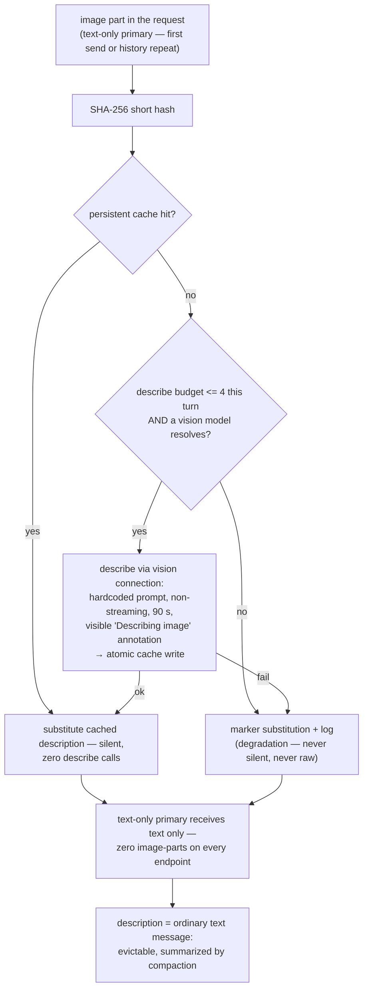

# 0015. Unified Vision Descriptions + Compaction Default ON

**Date:** 2026-09-15
**Status:** Accepted — landed with the v0.19.0 slice (this ADR is task T4 of the slice). **Amended 2026-09-15 (owner field report): variant (v) supersedes variant (b) for vision-capable primaries — v0.19.1, merge 29c4cb6. The amended master invariant (6) is pending ArchCom ratification.**
**Extends:** ADR 0013 (two-phase mechanics remain authoritative)
**Supersedes:** the v0.13.0 `compaction.enabled` default-off posture. The original variant-(b) verdict also superseded the ADR 0013 lifecycle extension (2026-09-15, first-send-raw, shipped in v0.18.0) at the new `marker` default — that supersession is LIFTED by the 2026-09-15 amendment: the extension is back in force for vision-capable primaries.

## Deciders

- `@GCW: Tech Lead` (chair, engineering owner) — variant (b) as a single v0.19.0 release; rollback without rebuild
- `@GCW: Senior System Engineer` — variant (b) at the "the first turn too" bar; variant (v) held as opt-in on field complaints
- `@GCW: Senior Security Engineer` — variant (b) with the fixed describe-prompt and delimiter preserved; privacy wins (bytes uploaded once)
- `@GCW: Product Architect` — strict reading of the owner directive; "qualitatively test" = default flip + gates G1–G4

Committee verdict: variant (b), quick panel, chair verdict (protocol 2026-09-15).

Amendment (same day, owner field report): variant (v) — pre-approved by the committee as the option on field complaints — SUPERSEDES variant (b) for vision-capable primaries. The complaint arrived: v0.19.0's unified describe stripped a vision-capable primary (`glm-5.3-flash`) of direct sight. Landed as v0.19.1 (merge 29c4cb6, branch `fix/vision-primary-raw-first`).

## Context

Owner directive (2026-09-15):

> «картинка в контексте ни при каком раскладе жить НЕ ДОЛЖНА — модель получила, обработала, дальше в контексте живёт ТОЛЬКО её описание, и оно подпадает под общую компакцию»

The protocol renders the companion clause as «компакцию включить и качественно
протестировать». Three gaps make the directive non-trivial:

1. **Two-phase was text-only-only.** ADR 0013 routes a text-only primary
   through describe→answer, but a vision-capable primary
   (`capabilities.imageInput`) still took the native raw path. Two code
   paths, two lifecycles.
2. **The v0.18 lifecycle lets the first send through.** The ADR 0013
   lifecycle extension (`src/visionHistory.ts`) forwards the FIRST send of
   each image raw and marks only repeats — one screenshot still ships
   ~2 M chars of base64 to the cloud on its first turn, and the marker set
   is in-memory (a reload allows one raw re-send per image). The RCA
   (mnemos 1731bef7) showed exactly this class of megabyte re-send killing
   subagent delegations on context overflow.
3. **Compaction ships default-off.** Since v0.13.0 compaction is opt-in
   with a one-time 75% inflation warning; descriptions "falling under
   compaction" is posture, not tested behaviour.

The directive closes all three at once: describe every image on every
primary, and flip compaction default-on with unchanged tuning, verified
through the gate suite. The «describe every image on every primary»
reading was amended the same day (see Decision): the directive now
closes by primary type — raw-first for vision-capable primaries,
describe for text-only ones.

## Decision

Variant (v) (amendment 2026-09-15 — supersedes variant (b) for
vision-capable primaries): **vision dispatch is typed by the primary's
image capability.** A VISION-CAPABLE primary sees the image RAW on the
first send; the v0.18 marker lifecycle replaces every history re-send
with an in-band marker. A TEXT-ONLY primary keeps the two-phase describe
unchanged — the description is its only channel.
`ollamaCloud.visionHistory.mode='raw'` retains the v0.18 semantics for
both primary types.

Why (v): the owner's field report showed that variant (b) — unified
describe for ALL primaries — strips a vision-capable primary of direct
sight and routes its answer through a second model's text. The committee
had held variant (v) as the option for exactly this complaint. Pixels
reach the primary once (the first send); afterwards the context carries
only markers, so the directive's «картинка в контексте не живёт» clause
holds — and the text-only channel, which cannot see pixels at all, keeps
describe.

Original verdict, kept for the record: variant (b) — unified two-phase
describe for ALL primaries carrying images, the primary never receiving
an image-part, sole opt-out `visionHistory.mode='raw'`. Superseded the
same day by the field report; the text-only half of the verdict stands.

### Dispatch by primary type (variant (v), task T1 as amended)

The vision gate dispatches by the primary's image capability:

- **Vision-capable primary** (`capabilities.imageInput`): the primary
  sees the image RAW on the first send — no describe round-trip, no
  describe budget consumed. The v0.18 marker lifecycle records the
  image's content hash and replaces every HISTORY re-send of the same
  hash with an in-band ~100-char marker. A reload clears the in-memory
  hash set (one acceptable raw re-send per image per session).
- **Text-only primary** (with `visionFallback.enabled`, ADR 0013/0004
  contract): the two-phase describe runs exactly as before — hardcoded
  `VISION_DESCRIBE_PROMPT`, non-streaming `nativeChatOnce`, 90 s timeout,
  delimiter-wrapped description substituted into the history. Budget:
  **at most 4 describe calls per turn**; images past the budget degrade
  to markers (per-turn overlay, never cached — review P1-2). A describe
  failure **throws** (describe-all-or-throw) and the failed description
  is never cached — the next turn retries the honest describe.
- `capabilities.imageInput` no longer routes any primary through a
  describe path it cannot serve; `visionHistory.mode` retains the v0.18
  semantics for both primary types (first send raw, repeats marked).
- The ADR 0013 persistent atomic cache
  (`<globalStorage>/vision-description-cache.json`, SHA-256 key) stays
  the lifecycle mechanism on the text-only channel: repeat sends are
  silent cache hits with zero describe calls, and the guarantee survives
  window reloads.
- The `🖼️ Describing image via <visionModel>` annotation stays visible
  on real describes (cache hits stay silent, as in ADR 0013).
- Pass-through (`ollamaCloud.visionFallback.mode='pass-through'`) remains
  the ADR 0013 fallback/debug path — with the repeat-marker lifecycle
  applied to its history in `marker` mode.

This diagram is the TEXT-ONLY channel (variant (b)'s path, unchanged by
the amendment). The vision-capable channel bypasses it entirely: the
first send forwards the raw part, and the v0.18 lifecycle markers every
repeat before dispatch.

### `visionHistory.mode` semantics (amended)

| Mode | Default | Behaviour |
|---|---|---|
| `marker` | **default** | NOT "describe for every primary" (that was variant (b)): a vision-capable primary sees the image RAW on the first send and markers on every history repeat; a text-only primary runs the two-phase describe (budget ≤4/turn, throw on failure, per-turn marker overlay for degradation — never cached). |
| `raw` | opt-out | The v0.18 semantics for BOTH primary types: the first send of each image goes raw, repeats from history are marked (in-memory per-window set; a reload allows one raw re-send per image). Text-only primaries keep the ADR 0013 describe (it is their only channel). |

The lifecycle itself (repeat → marker) is mode-independent and applies
on the primary dispatch path regardless of the mode; `marker` vs `raw`
differs only in whether the first send may go raw to the primary.

### Relationship to ADR 0013

ADR 0013 remains authoritative for the two-phase mechanics — describe
prompt, cache, delimiter wrapping (`wrapDescription`),
substitution-before-dispatch, and the security invariants. Its lifecycle
extension (2026-09-15, first-send-raw, shipped v0.18.0) was superseded at
the new default by variant (b), and the amendment LIFTS that supersession
for vision-capable primaries: under `mode='marker'` the extension is back
in force on the vision-capable channel (first send raw, repeats marked),
while the text-only channel keeps the describe-unified contract. The
extension therefore remains authoritative on its original scope.

### Compaction default ON (task T2)

- `ollamaCloud.compaction.enabled` flips **false → true** in v0.19.0;
  thresholds and model are UNCHANGED: fire at 75% of the model window
  compacting down to 40%, recency window 25% of window tokens with a
  6-turn floor (larger coverage wins), tool_call/tool_result pairs never
  split, 5-minute rate guard, summarizer `gpt-oss:20b` (no retry, 60 s
  timeout, `think:false`).
- **Unknown-window never fires:** when the catalog cannot resolve the
  model's window (`maxInputTokens` missing/<= 0), compaction skips with a
  diagnostic log — it never fires against an unknown denominator.
- Fallback contract unchanged: a summarizer/store throw or timeout logs a
  warning and proceeds uncompacted — compaction never fails the chat.
- A description is an **ordinary text message**: not pinned, evictable,
  summarized with the rest of the history — the «подпадает под общую
  компакцию» clause is test-provable (gate G2).
- Both defaults roll back without a rebuild, settings only:
  `compaction.enabled=false`; `visionHistory.mode='raw'`.

### Phasing and gates

v0.19.0 as a single release: T1 dispatch by primary type (Senior System
Engineer; originally "describe-unification", re-scoped to variant (v) by
the same-day amendment), T2 compaction flip + unknown-window safe-path
(Senior System Engineer), T3 gate suite (QA), T4 this ADR + README (Tech
Writer). The amendment landed as the follow-up fix release v0.19.1
(merge 29c4cb6). Kept out of the slice (v0.20.0 candidates): TLS
BAD_DECRYPT RCA, `image.tag` alignment.

Gates (contract G0–G4; G1–G2 re-baselined to variant (v) by the field
fix, merge 29c4cb6):

- **G0** — verify-green (compile, lint, unit suite).
- **G1 unit** — four lifecycle gates: (1) vision-capable primary in
  `marker` mode → RAW first send, zero describe calls; (2) re-send of
  the same image → history repeat is a marker, not pixels (v0.18
  lifecycle); (3) text-only primary in `marker` mode → two-phase
  describe fires (budget ≤4/turn; transient describe failure throws and
  is never cached — the next turn retries); (4) `raw` mode → first-send
  raw for a vision-capable primary with repeats still marked. Plus:
  delimiter wrapping, cache-hit zero describe calls, reload persistence.
- **G2 invariants** — part-counting over the dispatched payload: exactly
  ONE image part (the first send of a vision-capable primary, recency)
  and zero base64 beyond it after compaction fires; description
  evictable + summarized; tool-pair integrity; hysteresis/rate-guard;
  summarizer-throw passthrough.
- **G3 integration** — synthetic >75% session with tools and repeat
  images: exactly one fire per 5-minute window, post-fire payload
  <= 40% + recency, mid-session reload.
- **G4** — owner manual E2E.

## Invariants

| # | Invariant |
|---|---|
| 1 | Dispatch by primary type: a text-only primary goes through two-phase describe (the primary receives no image-part); a vision-capable primary sees the image RAW on the first send and every history repeat is marker-substituted (v0.18 lifecycle). One persistent atomic cache on the describe channel. |
| 2 | Degradation, never silence: on the text-only channel, budget exhaustion degrades to marker substitution + log (never cached); a describe failure throws — it is never silently converted to raw. Raw pixels never reach a text-only primary, and never reach a vision-capable primary after the first send. |
| 3 | Describe budget: at most 4 calls per turn; excess images → markers; the "Describing image" annotation is visible on real describes. |
| 4 | Compaction default ON with unchanged tuning: 75→40 hysteresis, recency 25%/6 turns, 5-min rate guard, `gpt-oss:20b` (no-retry, 60 s, `think:false`); unknown-window never fires. |
| 5 | A description is an ordinary text message: not pinned, evictable, summarized. |
| 6 | Master invariant: zero image-parts in every outgoing payload — all endpoints, all modes — EXCEPT the single first-send raw part of a vision-capable primary in `marker` mode, and except the pass-through fallback (one raw send per turn). After that first send the image's only presence is in-band markers; the describe fetch (text-only channel) never carries image parts to the primary. (The `raw` opt-out intentionally relaxes this to the v0.18 semantics — same first-send exception, repeats still marked.) **Pending ratification:** this re-baselined master invariant (and the variant-(v) supersession behind it) goes to the Architectural Committee for ratification. |
| 7 | Compaction fallback unchanged: summarizer throw/timeout → log + uncompacted proceed; compaction never fails the chat. |
| 8 | Slice boundary: TLS BAD_DECRYPT, `image.tag`, Marketplace publication, and mid-stream retry stay out of this slice. Variant (v) — landed by the amendment (v0.19.1, merge 29c4cb6), no longer deferred. |

### Pass-through exception (review P1-1, chair decision 2026-09-15)

The pass-through vision fallback (`visionFallback.mode='pass-through'`) is an EXPLICIT exception to invariant 6: the vision model answers the user DIRECTLY in that mode, and it must see the image to do so. Exactly ONE raw send per turn reaches the fallback vision model (repeats from history are marker-substituted in `marker` mode); no other payload path carries image parts beyond the vision-capable primary's single first-send raw part. The user-facing annotation in pass-through mode discloses that the image is processed by the fallback model.

## Consequences

### Positive

- **Direct sight restored for vision primaries:** a vision-capable
  primary answers from pixels on the first send — the field complaint
  (glm-5.3-flash answering through a second model's description) is
  resolved without giving up the lifecycle.
- **Cost class:** on the vision-capable channel, no describe call at
  all; on the text-only channel, +1 cheap describe call per NEW image,
  repeats free (persistent cache — zero describe calls on a hit).
- **Privacy:** image bytes are uploaded at most once per image per
  session; history re-sends carry ~100-char markers or cached text,
  never megabytes of base64.
- **One lifecycle, one describe path:** the v0.18 marker lifecycle (all
  dispatch branches) and the ADR 0013 describe machinery (text-only
  channel) already existed — the amendment removed the variant-(b)
  describe branch instead of adding a third code path.
- **Security carried over free:** hardcoded describe prompt (ADR 0004
  constraint 7), delimiter wrapping, SEC-03 per-connection whitelist;
  the cache stores description TEXT only — image bytes are never
  persisted.
- **Context health:** descriptions and markers are ordinary evictable
  text under default-on compaction — the directive's compaction clause
  holds by construction, not by tuning.

### Negative / accepted

| Risk | Mitigation | Why accepted |
|---|---|---|
| Vision-primary first-send carries raw bytes (accepted, single occurrence; repeats markered) | the v0.18 lifecycle records the hash and replaces every history re-send with an in-band marker; a reload allows one raw re-send per image (matching the two-phase posture's session semantics) | the field report ranks first-turn direct sight above the absolute zero-image-parts reading; the amended master invariant (6) carries this exception and awaits ArchCom ratification |
| Describe-budget excess is chosen FIFO by history order (oldest first) — on a turn with 5+ new images the freshly-pasted one may degrade to a marker | Follow-up: prioritize the LAST user message's images when slicing the budget (review P2-1) | text-only channel only; budget resets every turn and degraded markers are never cached |
| A describe failure degrades the turn to markers (budget) or throws (hard failure) | honest marker + log for over-budget images; throw + no-cache for failures so the next turn retries the honest describe | degradation is visible; nothing poisoned persists (review P1-2) |
| Describe adds one hop to image turns | budget at most 4/turn; one-shot non-streaming call with 90 s timeout on a cheap model — text-only channel only | a single call per new image only |
| Compaction fires for users who never opted in | unchanged thresholds; never-fails-the-chat fallback; unknown-window never fires; rollback without rebuild | «качественно протестировать» = default flip + gates G1–G4 (Product Architect position) |

## Alternatives considered

| Alternative | Verdict | Rationale |
|---|---|---|
| (v) hybrid — first send raw + parallel describe, later turns from cache | **adopted by field report 2026-09-15** (owner field report; merge 29c4cb6) — supersedes variant (b) for vision-capable primaries; the master invariant re-baselined with the first-send exception, pending ArchCom ratification | best first-turn quality; the conditional master invariant («zero image-parts EXCEPT the single first send») is now the accepted posture, and the committee had pre-approved (v) as the option on exactly this field complaint |
| (b) unified describe for ALL primaries (original verdict) | adopted 2026-09-15, superseded the same day for vision-capable primaries by (v) | one code path and a provable master invariant — but the field report showed it strips a vision-capable primary of direct sight; the text-only half stands |
| (a) primary self-describes — the primary model converts the image to text itself | rejected | doubles the expensive primary call: 60–70 s reasoning TTFT twice per image turn + double billing |
| Keep the v0.18 lifecycle as default (first send raw, repeats marked) | rejected at panel time as the universal default; its mechanics are now the vision-capable channel of the amended decision | as a universal rule it starves the text-only channel of the describe machinery; as the vision-capable rule it is exactly variant (v) |
| Keep compaction opt-in (default off) | rejected | descriptions must fall under compaction in behaviour, not in posture; the v0.12.1 inflation warning was a stopgap |

## References

- Owner field report (2026-09-15) and its fix release: merge 29c4cb6
  (`fix/vision-primary-raw-first`, v0.19.1) — variant (v) supersedes
  variant (b) for vision-capable primaries; test doc-head updated in
  e1ef9bf (`test/integration/unifiedVision.test.ts`).
- Committee protocol (2026-09-15): `~/.gcw/architectural-committee/2026-09-15-ocp-unified-vision-compaction.md`
- Mnemos decision id: `573d565c-3b41-4c79-8353-75e6607c0392` (tags: `project:ollama-cloud-provider`, `committee`)
- ADR 0004 — vision fallback pass-through (constraint 7: hardcoded describe prompt)
- ADR 0013 — two-phase vision fallback (mechanics authoritative; its 2026-09-15 lifecycle extension re-affirmed for vision-capable primaries by the amendment)
- ADR 0014 — stream reliability + live capability probing (capability resolution feeding the vision gate)
- `docs/compaction-spec.md` — compaction contract (thresholds unchanged; the default-off posture superseded)
- Code: `src/visionHistory.ts` (v0.18 marker lifecycle — the vision-capable channel at the default), `src/visionTwoPhase.ts` (describe, cache, delimiter, budget, throw-on-failure), `src/compaction.ts` (`shouldCompact`), `src/provider.ts` (typed vision dispatch, `maybeCompact`, endpoint dispatch)