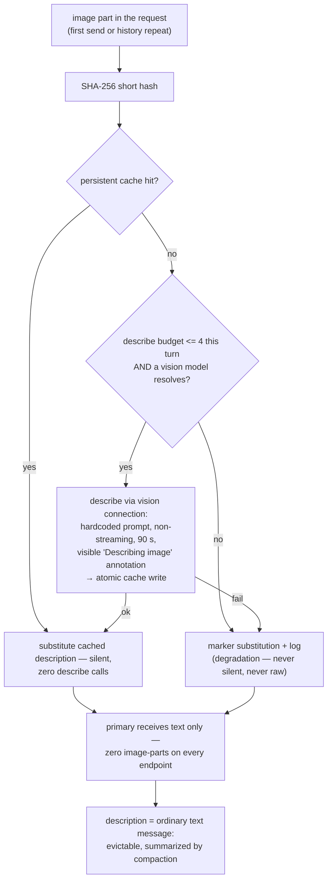

# 0015. Unified Vision Descriptions + Compaction Default ON

**Date:** 2026-09-15
**Status:** Accepted — lands with the v0.19.0 slice (this ADR is task T4 of the slice)
**Extends:** ADR 0013 (two-phase mechanics remain authoritative)
**Supersedes:** the ADR 0013 lifecycle extension (2026-09-15, first-send-raw, shipped in v0.18.0) for the new `marker` default; the v0.13.0 `compaction.enabled` default-off posture

## Deciders

- `@GCW: Tech Lead` (chair, engineering owner) — variant (b) as a single v0.19.0 release; rollback without rebuild
- `@GCW: Senior System Engineer` — variant (b) at the "the first turn too" bar; variant (v) held as opt-in on field complaints
- `@GCW: Senior Security Engineer` — variant (b) with the fixed describe-prompt and delimiter preserved; privacy wins (bytes uploaded once)
- `@GCW: Product Architect` — strict reading of the owner directive; "qualitatively test" = default flip + gates G1–G4

Committee verdict: variant (b), quick panel, chair verdict (protocol 2026-09-15).

## Context

Owner directive (2026-09-15):

> «картинка в контексте ни при каком раскладе жить НЕ ДОЛЖНА — модель получила, обработала, дальше в контексте живёт ТОЛЬКО её описание, и оно подпадает под общую компакцию»

The protocol renders the companion clause as «компакцию включить и качественно
протестировать». Three gaps make the directive non-trivial:

1. **Two-phase was text-only-only.** ADR 0013 routes a text-only primary
   through describe→answer, but a vision-capable primary
   (`capabilities.imageInput`) still took the native raw path. Two code
   paths, two lifecycles.
2. **The v0.18 lifecycle lets the first send through.** The ADR 0013
   lifecycle extension (`src/visionHistory.ts`) forwards the FIRST send of
   each image raw and marks only repeats — one screenshot still ships
   ~2 M chars of base64 to the cloud on its first turn, and the marker set
   is in-memory (a reload allows one raw re-send per image). The RCA
   (mnemos 1731bef7) showed exactly this class of megabyte re-send killing
   subagent delegations on context overflow.
3. **Compaction ships default-off.** Since v0.13.0 compaction is opt-in
   with a one-time 75% inflation warning; descriptions "falling under
   compaction" is posture, not tested behaviour.

The directive closes all three at once: describe every image on every
primary, and flip compaction default-on with unchanged tuning, verified
through the gate suite.

## Decision

Variant (b): **unified two-phase describe for ALL primaries carrying
images — including vision-capable ones (e.g. `glm-5.3-flash`). The primary
NEVER receives an image-part; the sole opt-out is
`ollamaCloud.visionHistory.mode='raw'`.**

Why (b): the two-phase machinery already exists (one code path), the
master invariant below becomes provable, and the cost class — one cheap
describe per NEW image, repeats free — was already accepted by the owner.

### Unified describe path (task T1)

- Every image in the request — first send included — goes through the
  ADR 0013 two-phase path: the vision connection describes it (hardcoded
  `VISION_DESCRIBE_PROMPT`, non-streaming `nativeChatOnce`, 90 s timeout)
  and the primary receives only the delimiter-wrapped text.
- `capabilities.imageInput` no longer routes any primary to a raw path;
  `visionHistory.mode` is the sole switch.
- The ADR 0013 persistent atomic cache
  (`<globalStorage>/vision-description-cache.json`, SHA-256 key) becomes
  the single lifecycle mechanism at the default: repeat sends are silent
  cache hits with zero describe calls, and the guarantee survives window
  reloads.
- Describe budget: **at most 4 describe calls per turn**; images past the
  budget degrade to markers. The `🖼️ Describing image via <visionModel>`
  annotation stays visible on real describes (cache hits stay silent, as
  in ADR 0013).
- Degradation is never silence and never raw-by-default: describe
  failure, no vision model, or budget exhaustion → marker substitution +
  log. Raw pixels reach a model ONLY under the explicit `raw` opt-out.
- Pass-through (`ollamaCloud.visionFallback.mode='pass-through'`) remains
  the ADR 0013 fallback/debug path.

### `visionHistory.mode` semantics (flipped by this ADR)

| Mode | Default | Behaviour |
|---|---|---|
| `marker` | **new default** | Describe always — first send included. Zero image-parts in every outgoing payload; persistent cache; budget cap; visible annotations. |
| `raw` | opt-out | The v0.18 lifecycle as shipped: first send of an image goes raw, repeats from history are marked (in-memory per-window set; a reload allows one raw re-send per image). |

### Relationship to ADR 0013

ADR 0013 remains authoritative for the two-phase mechanics — describe
prompt, cache, delimiter wrapping (`wrapDescription`),
substitution-before-dispatch, and the security invariants. Its lifecycle
extension (2026-09-15, first-send-raw, shipped v0.18.0) is **superseded
at the new default**: under `mode='marker'` even the first send is
described. The first-raw behaviour survives only inside the `raw` opt-out.

### Compaction default ON (task T2)

- `ollamaCloud.compaction.enabled` flips **false → true** in v0.19.0;
  thresholds and model are UNCHANGED: fire at 75% of the model window
  compacting down to 40%, recency window 25% of window tokens with a
  6-turn floor (larger coverage wins), tool_call/tool_result pairs never
  split, 5-minute rate guard, summarizer `gpt-oss:20b` (no retry, 60 s
  timeout, `think:false`).
- **Unknown-window never fires:** when the catalog cannot resolve the
  model's window (`maxInputTokens` missing/<= 0), compaction skips with a
  diagnostic log — it never fires against an unknown denominator.
- Fallback contract unchanged: a summarizer/store throw or timeout logs a
  warning and proceeds uncompacted — compaction never fails the chat.
- A description is an **ordinary text message**: not pinned, evictable,
  summarized with the rest of the history — the «подпадает под общую
  компакцию» clause is test-provable (gate G2).
- Both defaults roll back without a rebuild, settings only:
  `compaction.enabled=false`; `visionHistory.mode='raw'`.

### Phasing and gates

v0.19.0 as a single release: T1 describe-unification (Senior System
Engineer), T2 compaction flip + unknown-window safe-path (Senior System
Engineer), T3 gate suite (QA), T4 this ADR + README (Tech Writer). Kept
out of the slice (v0.20.0 candidates): TLS BAD_DECRYPT RCA,
`image.tag` alignment.

Gates (contract G0–G4):

- **G0** — verify-green (compile, lint, unit suite).
- **G1 unit** — zero image-parts to a vision-capable primary; cache-hit
  zero describe calls; degradation paths; budget; reload persistence;
  delimiter wrapping.
- **G2 invariants** — zero image-parts in all payloads on all endpoints;
  description evictable + summarized; tool-pair integrity;
  hysteresis/rate-guard; summarizer-throw passthrough.
- **G3 integration** — synthetic >75% session with tools and repeat
  images: exactly one fire per 5-minute window, post-fire payload
  <= 40% + recency, mid-session reload.
- **G4** — owner manual E2E.

## Invariants

| # | Invariant |
|---|---|
| 1 | Two-phase describe for every primary with images, vision-capable included; the primary receives no image-part (sole exception: `visionHistory.mode='raw'`); one persistent atomic cache. |
| 2 | Degradation, never silence: describe failure / no vision model / budget exceeded → marker substitution + log — never raw without an explicit opt-out. |
| 3 | Describe budget: at most 4 calls per turn; excess images → markers; the "Describing image" annotation is visible on real describes. |
| 4 | Compaction default ON with unchanged tuning: 75→40 hysteresis, recency 25%/6 turns, 5-min rate guard, `gpt-oss:20b` (no-retry, 60 s, `think:false`); unknown-window never fires. |
| 5 | A description is an ordinary text message: not pinned, evictable, summarized. |
| 6 | Master invariant: zero image-parts in every outgoing payload — all endpoints, all modes except the explicit opt-outs. The image's only trip to the cloud is the describe fetch itself. |
| 7 | Compaction fallback unchanged: summarizer throw/timeout → log + uncompacted proceed; compaction never fails the chat. |
| 8 | Slice boundary: TLS BAD_DECRYPT, `image.tag`, Marketplace publication, mid-stream retry, and variant (v) stay out of this slice. |

### Pass-through exception (review P1-1, chair decision 2026-09-15)

The pass-through vision fallback (`visionFallback.mode='pass-through'`) is an EXPLICIT exception to invariant 6: the vision model answers the user DIRECTLY in that mode, and it must see the image to do so. Exactly ONE raw send per turn reaches the fallback vision model (repeats from history are still marker-substituted by the ADR 0013 lifecycle); no other payload path carries image parts in `marker` mode. The user-facing annotation in pass-through mode discloses that the image is processed by the fallback model.

## Consequences

### Positive

- **Cost class:** +1 cheap describe call per NEW image; repeats are free
  (persistent cache — zero describe calls on a hit). Already accepted by
  the owner.
- **Privacy:** image bytes are uploaded to the cloud exactly once per
  image; history re-sends carry ~100-char markers or cached text, never
  megabytes of base64.
- **One code path:** the ADR 0013 machinery (cache, degradation,
  annotations) already existed; vision-capable primaries join it — no
  third code path, and the master invariant becomes provable.
- **Security carried over free:** hardcoded describe prompt (ADR 0004
  constraint 7), delimiter wrapping, SEC-03 per-connection whitelist;
  the cache stores description TEXT only — image bytes are never
  persisted.
- **Context health:** descriptions are ordinary evictable text under
  default-on compaction — the directive's compaction clause holds by
  construction, not by tuning.

### Negative / accepted

| Risk | Mitigation | Why accepted |
|---|---|---|
| A vision-capable primary loses direct sight — even the first send is a description, not pixels | detailed hardcoded describe prompt; `visionHistory.mode='raw'` restores the v0.18 first-raw lifecycle; variant (v) held as opt-in if the field complains about first-turn quality | the directive ranks «no images in context, ever» above first-turn fidelity |
| Describe-budget excess is chosen FIFO by history order (oldest first) — on a turn with 5+ new images the freshly-pasted one may degrade to a marker | Follow-up: prioritize the LAST user message's images when slicing the budget (review P2-1) |
| A describe failure degrades the turn to markers | honest marker + log, visible annotation — never silent, never raw | degradation is visible by invariant 2; raw without opt-out would violate the master invariant |
| Describe adds one hop to image turns | budget at most 4/turn; one-shot non-streaming call with 90 s timeout on a cheap model | a single call per new image only |
| Compaction fires for users who never opted in | unchanged thresholds; never-fails-the-chat fallback; unknown-window never fires; rollback without rebuild | «качественно протестировать» = default flip + gates G1–G4 (Product Architect position) |

## Alternatives considered

| Alternative | Verdict | Rationale |
|---|---|---|
| (a) primary self-describes — the primary model converts the image to text itself | rejected | doubles the expensive primary call: 60–70 s reasoning TTFT twice per image turn + double billing |
| (v) hybrid — first send raw + parallel describe, later turns from cache | deferred — option on field complaints | best first-turn quality, but a conditional invariant («zero image-parts EXCEPT the first send») and a third code path |
| Keep the v0.18 lifecycle as default (first send raw, repeats marked) | rejected | violates the directive: the first send still ships raw image bytes; the master invariant is unprovable |
| Keep compaction opt-in (default off) | rejected | descriptions must fall under compaction in behaviour, not in posture; the v0.12.1 inflation warning was a stopgap |

## References

- Committee protocol (2026-09-15): `~/.gcw/architectural-committee/2026-09-15-ocp-unified-vision-compaction.md`
- Mnemos decision id: `573d565c-3b41-4c79-8353-75e6607c0392` (tags: `project:ollama-cloud-provider`, `committee`)
- ADR 0004 — vision fallback pass-through (constraint 7: hardcoded describe prompt)
- ADR 0013 — two-phase vision fallback (mechanics unified here; its 2026-09-15 lifecycle extension superseded at the default)
- ADR 0014 — stream reliability + live capability probing (capability resolution feeding the vision gate)
- `docs/compaction-spec.md` — compaction contract (thresholds unchanged; the default-off posture superseded)
- Code: `src/visionHistory.ts` (v0.18 lifecycle — becomes the `raw` opt-out), `src/visionTwoPhase.ts` (describe, cache, delimiter), `src/compaction.ts` (`shouldCompact`), `src/provider.ts` (`maybeCompact`, endpoint dispatch)